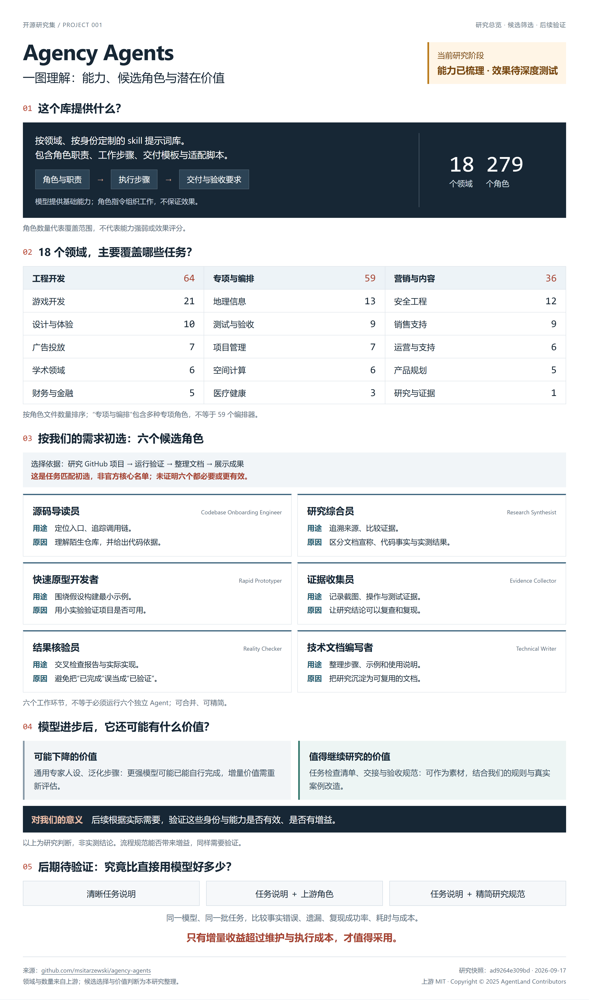
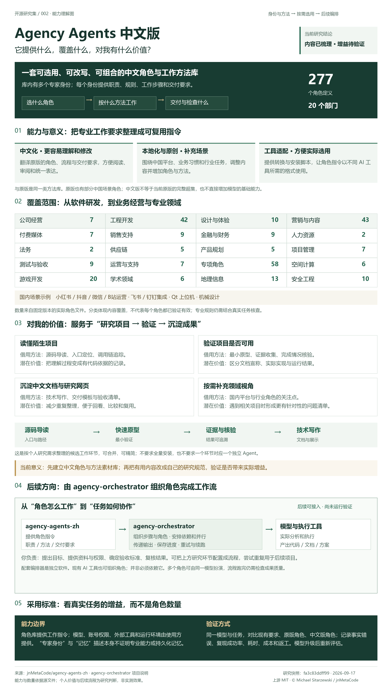
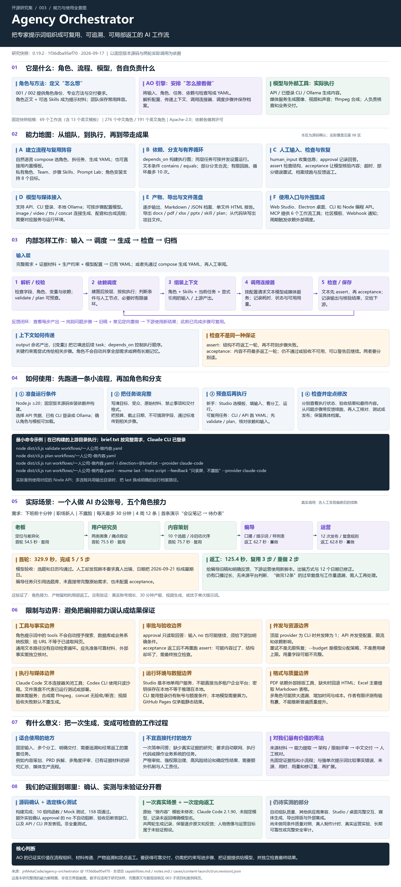
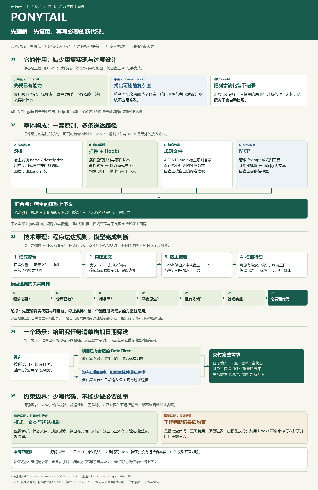

# GitHub 项目研究集

记录值得深入研究的 GitHub 项目：理解设计、运行验证、整理实践，并逐步积累可体验的 Web 演示。

这里是摘要与导航入口。源码分析、运行步骤、截图和实验结论保存在各子项目中。

## 项目索引

项目按固定编号升序排列；编号分配后不随研究状态变化，也不重复使用。

<!-- PROJECT_INDEX:START -->
| 编号 | 项目 | 研究摘要 | 状态 | 上游 | Web 演示 |
| --- | --- | --- | --- | --- | --- |
| 001 | [Agency Agents](projects/001-agency-agents/README.md) | 按领域和身份提供角色提示词、工作步骤与交付要求，覆盖工程、设计、测试等18个领域、279个角色；供我们按实际任务选取并验证能否提升效果，价值可能随模型升级变化。 | 研究中 | <a href="https://github.com/msitarzewski/agency-agents">msitarzewski/agency-agents</a> | <a href="https://yydshly.github.io/0917_codex_project/apps/001-agency-agents/">访问演示</a> |
| 002 | [Agency Agents 中文版](projects/002-agency-agents-zh/README.md) | 中文角色与工作方法库，提供20个部门、277个角色的职责、步骤和交付要求，并做中国场景适配；为我的项目研究、验证和中文文档沉淀提供可复用方法，后续可由独立编排器调度，实际增益待验证。 | 研究中 | <a href="https://github.com/jnMetaCode/agency-agents-zh">jnMetaCode/agency-agents-zh</a> | <a href="https://yydshly.github.io/0917_codex_project/apps/002-agency-agents-zh/">访问演示</a> |
| 003 | [Agency Orchestrator](projects/003-agency-orchestrator/README.md) | 面向具体场景选择角色、拆分任务并按依赖编排执行，支持结果传递、运行留档与局部返工；适用于内容策划、产品方案和研究评审。对我们的价值是复用流程、追溯结果与减少重复执行；质量增益和角色冗余仍需后续用真实产品任务对照验证。 | 研究中 | <a href="https://github.com/jnMetaCode/agency-orchestrator">jnMetaCode/agency-orchestrator</a> | <a href="https://yydshly.github.io/0917_codex_project/apps/003-agency-orchestrator/">访问演示</a> |
| 004 | [Ponytail](projects/004-ponytail/README.md) | 指导 AI 开发前先理解需求、优先复用已有代码与平台能力，以必要的新增代码完成需求，并提供改动审查、全库精简建议和已标记技术债汇总。核心是 Skill 工程规则，经插件与 Hooks、静态规则文件或 MCP 进入模型上下文，再由宿主 AI 读取项目、选择方案、修改和验证；属于提示约束，实际收益待对照验证。 | 研究中 | <a href="https://github.com/DietrichGebert/ponytail">DietrichGebert/ponytail</a> | <a href="https://yydshly.github.io/0917_codex_project/apps/004-ponytail/">访问演示</a> |
<!-- PROJECT_INDEX:END -->

## 项目预览

<!-- PROJECT_GALLERY:START -->
### 001 · Agency Agents

<a href="projects/001-agency-agents/README.md"></a>

按领域和身份提供角色提示词、工作步骤与交付要求，覆盖工程、设计、测试等18个领域、279个角色；供我们按实际任务选取并验证能否提升效果，价值可能随模型升级变化。

### 002 · Agency Agents 中文版

<a href="projects/002-agency-agents-zh/README.md"></a>

中文角色与工作方法库，提供20个部门、277个角色的职责、步骤和交付要求，并做中国场景适配；为我的项目研究、验证和中文文档沉淀提供可复用方法，后续可由独立编排器调度，实际增益待验证。

### 003 · Agency Orchestrator

<a href="projects/003-agency-orchestrator/README.md"></a>

面向具体场景选择角色、拆分任务并按依赖编排执行，支持结果传递、运行留档与局部返工；适用于内容策划、产品方案和研究评审。对我们的价值是复用流程、追溯结果与减少重复执行；质量增益和角色冗余仍需后续用真实产品任务对照验证。

### 004 · Ponytail

<a href="projects/004-ponytail/README.md"></a>

指导 AI 开发前先理解需求、优先复用已有代码与平台能力，以必要的新增代码完成需求，并提供改动审查、全库精简建议和已标记技术债汇总。核心是 Skill 工程规则，经插件与 Hooks、静态规则文件或 MCP 进入模型上下文，再由宿主 AI 读取项目、选择方案、修改和验证；属于提示约束，实际收益待对照验证。
<!-- PROJECT_GALLERY:END -->

## 新增研究项目

需要 Python 3.10 或更新版本，无第三方依赖。在仓库根目录运行：

```sh
python scripts/projects.py new example-repo --name "项目名称" --repo https://github.com/owner/example-repo --summary "一句话介绍研究重点"
```

命令自动分配编号、创建研究文档，并更新首页索引。修改子项目的 `project.json` 后运行：

```sh
python scripts/projects.py sync
```

## 仓库导航

| 目录 / 文档 | 用途 |
| --- | --- |
| [projects/](projects/) | 按编号组织的研究项目、笔记与图片 |
| [templates/project/](templates/project/) | 统一的子项目文档模板 |
| [研究约定](docs/research-guide.md) | 编号规则、研究流程、图片与源码管理 |
| [Web 部署说明](docs/deployment.md) | 多个演示的路径规划与 GitHub Pages 部署方式 |
| [site/](site/) | 已部署的静态研究展示与导航 |

上游项目的源码、图片与其他素材遵循各自许可证；引用和修改时在子项目中记录来源。
