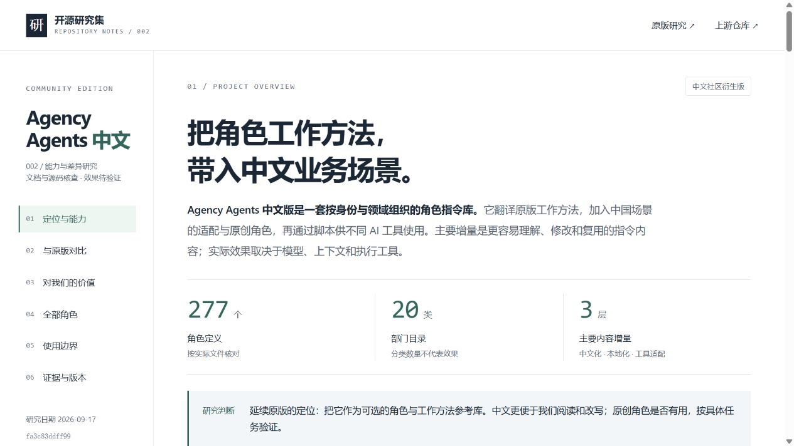
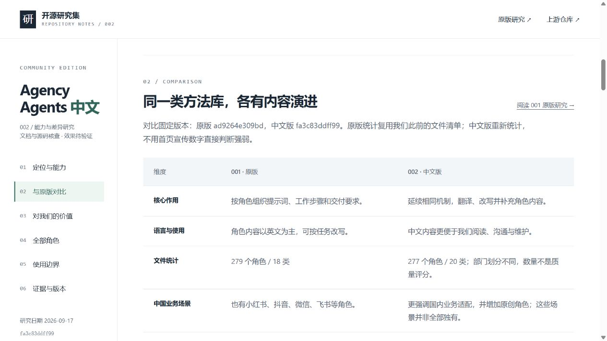

# 截图与验证记录

项目当前主图为 [capability-summary.png](capability-summary.png)：能力、范围、个人价值与后续编排关系的原创研究信息图，非运行截图。参见[内容与制作说明](capability-summary-brief.md)。下方保留历史网页截图。

截图日期：2026-09-17。来源：本地构建页 `http://127.0.0.1:8766/apps/002-agency-agents-zh/`，使用浏览器直接捕获，未用生成图代替运行结果。

| 文件 | 内容 | 说明 |
| --- | --- | --- |
| desktop-overview.png | 桌面首屏：定位、数量、研究判断 | 默认浏览器视口 |
| desktop-comparison.png | 与原版的对比表 | 默认浏览器视口 |
| mobile-overview.png | 手机首屏与横向章节导航 | 390 × 844 测试视口 |

## 已完成的验证

- 根索引元数据检查、整个站点构建通过。
- 277 个角色来自保存的实际文件清单，20 个部门全部输出。
- 搜索“飞书”得到 1 个角色 / 1 个部门；无匹配关键词显示 0 个结果与提示。
- 重置恢复 277 个角色 / 20 个部门；选择测试部门得到 9 个角色 / 1 个部门。
- 浏览器未记录页面 JavaScript 错误。
- 308 个本地链接、章节锚点与固定版本源文件路径校验通过；站点索引可进入 002。
- 桌面首屏与对比表视觉检查通过；手机首屏无页面级横向溢出，章节导航允许区域内横向滚动。
- 手机搜索“飞书”结果正常；对比表在自身容器内横向滚动，未撑宽页面；桌面和手机章节高亮检查通过。

截图仅证明研究网页的显示状态，不证明角色效果、接口连接或自动编排已经运行。

