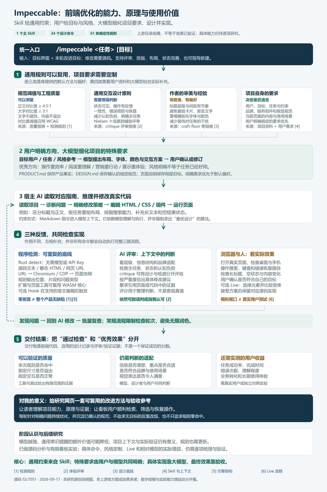
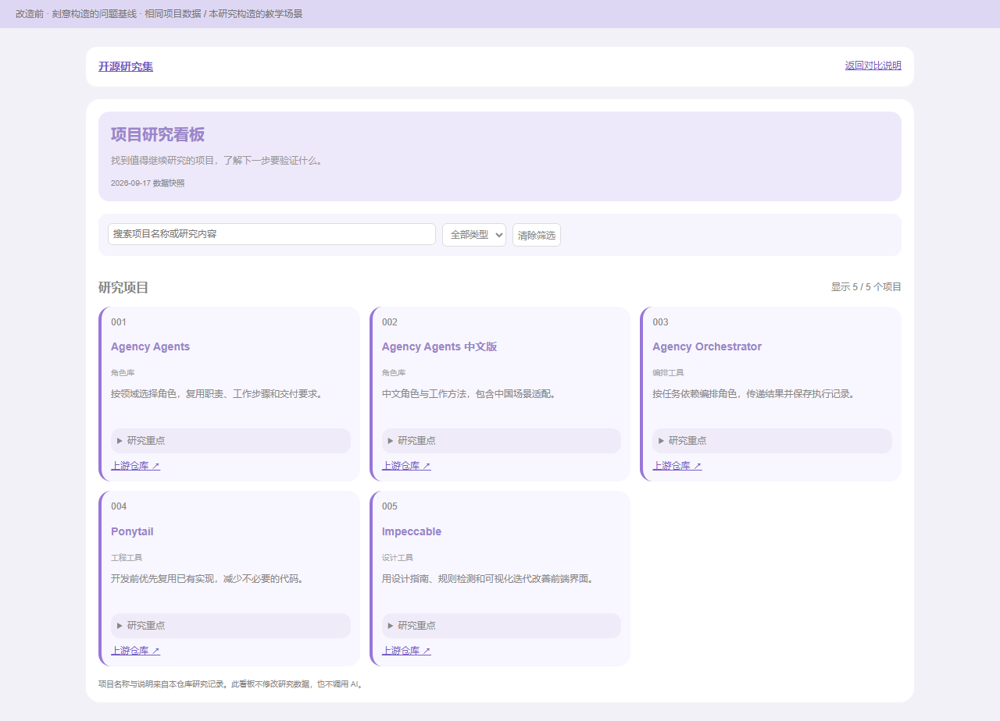
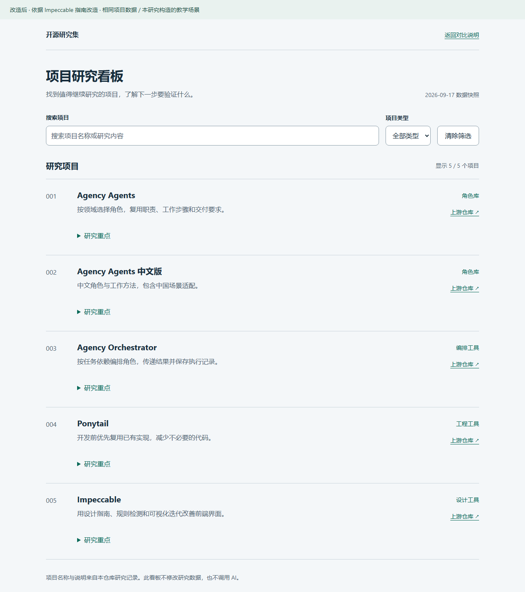

# 005 · Impeccable

面向前端界面优化：Skill 提供通用设计约束，用户明确风格和特殊要求，大模型据此细化方案并实现，检测器辅助检查。对我可作为网页改进的方法与验收参考；具体能力、适用场景和实际增益仍需后续逐项梳理与验证。

本项目目前完成定位与原理整理，以及一个有限的教学看板实验。命令表是初步目录，具体能力、风格定制效果和持续优化收益仍需后期实际梳理。以下用同一张引导图概括我们的认识。

[查看可放大的 SVG](assets/capability-summary.svg) · [图中文字与固定源码来源](assets/capability-summary-text.md) · [来源说明](assets/README.md)。本图为本研究原创分析图，非上游官方图或运行截图。

| 信息 | 内容 |
| --- | --- |
| 上游 | [pbakaus/impeccable](https://github.com/pbakaus/impeccable) |
| 源码基准 | [`f2c7051853848826aac2f4646581d62a732155ad`](https://github.com/pbakaus/impeccable/commit/f2c7051853848826aac2f4646581d62a732155ad)，commit 日期 2026-09-16；研究日期 2026-09-17 |
| 包 / 引擎 | 源码包 4.1.0；运行发布引擎 engine-v0.1.5，自报版本 4.0.0；分别记录，不视为同一版本 |
| 许可 | Apache-2.0；[许可副本](third-party/LICENSE.impeccable) · [NOTICE 副本](third-party/NOTICE.impeccable.md) |
| 能力规模 | 1 个主 Skill、24 个设计命令、61 条确定性规则，按源码快照核对 |
| 详细研究 | [能力与原理](capabilities.md) · [实验步骤与限制](notes.md) · [检测结果](experiments/results.json) · [浏览器验证](experiments/browser-checks.json) |
| 演示 | [研究网页](../../site/apps/005-impeccable/index.html) · [改造前](../../site/apps/005-impeccable/before.html) · [改造后](../../site/apps/005-impeccable/after.html) · [本地启动](web/README.md) |
| 发布状态 | [已公开部署](https://yydshly.github.io/0917_codex_project/apps/005-impeccable/) · [单张引导图](https://yydshly.github.io/0917_codex_project/apps/005-impeccable/#guide) · [首次发布验证](experiments/deployment.json) |

## 我们形成的理解

- **能力定位：前端优化。** 给定目标界面与改进目标，指导 AI 评审、修改并验证；也能指导从零设计。只有 URL 通常只能观察与评审，修改实现还需要源码。
- **技术本质：Skill 通用约束 + 项目定制 + 模型执行。** 设计常识、作者默认审美和工作流程可复用；用户明确目标、风格、参考和限制，大模型据此细化特殊要求，设计并修改代码。具体设计判断仍依赖模型。
- **项目定制不一定需要改 Skill。** PRODUCT.md 记录产品事实，DESIGN.md 记录确认的视觉规范，页面说明记录本轮目标；已有规则不等于永久正确，默认偏好应服从明确需求。
- **四种优秀方向。** 操作型重任务完成，阅读型重理解，说服型重价值与行动，体验型重作品探索；风格要求不能替代任务验收。
- **对我的意义。** 作为研究网页和演示的改进方法与验收参考，让读者看懂库的能力、原理和证据，让使用者顺利操作；具体价值需真实任务验证。
- **持续优化与模型升级。** 每轮围绕具体问题修改、验收或回退，沉淀已确认规范。模型增强后，通用提醒的边际收益可能下降，应重新比较有无 Skill 的质量、耗时与成本。
- **后续仍要研究。** 命令级输入输出与适用条件、实际风格定制、多轮优化、Live / Hook，以及相对当前模型的真实增益。有限教学实验不能替代这些验证。

## 初步能力目录（仍待逐项实测）

| 能力 | 代表入口 | 适用场景 | 边界 |
| --- | --- | --- | --- |
| 产品与设计上下文 | init、document、extract | 多轮开发沿用产品事实、规范与组件 | 需要准确资料；规范不能保证模型始终遵守 |
| 规划与评审 | shape、critique、audit | 新功能规划、体验评审、上线前检查 | 包含模型判断，不自动完成所有测试 |
| 视觉改进 | typeset、layout、colorize、polish | 层级不清、间距混乱、设计不一致 | 审美倾向应服从具体品牌与需求 |
| 完整体验 | harden、clarify、adapt、onboard | 长文本、空状态、异常、响应式 | 修改后仍要实测 |
| 确定性检测 | detect；可选编辑 Hook | 重复检查部分界面缺陷 | 无需模型/API Key，覆盖有限 |
| 可视化变体 | live、generate | 在本地页面比较真实代码方案 | 需要本地项目与宿主 Agent；本次未实跑 |

完整命令与技术原理见 [capabilities.md](capabilities.md)。

## 实际场景演示

任务是从五个项目中找到目标，了解下一步需要验证什么。数据取自本仓库 001–005 研究资料，两版共用 data.json、筛选逻辑和主体模板。

| 演示任务 | 改造前 | 改造后 | 对应方法 |
| --- | --- | --- | --- |
| 找 Impeccable 并查看研究重点 | 小字号、浅色文字、三列等权重卡片 | 可见标签、清晰层级、顺序列表 | typeset、layout |
| 手机筛选工程工具 | 1060px 固定容器横向溢出 | 控件重排，主要操作保持可用 | layout、harden |
| 阅读长项目标题 | 单行固定高度隐藏内容 | 自然换行，保留完整文字 | harden |
| 无搜索结果后恢复 | 空白列表，仅顶部清除入口 | 明确说明、恢复按钮与搜索焦点 | harden、clarify |

**实验性质：**改造前是本研究刻意构造的问题基线，改造后由当前 AI 依据上游指南实现。不是无 Skill / 有 Skill 的随机对照实验，也不是上游官方案例；不能推断 Skill 独立带来的质量、效率或转化率增益。本次定向应用参考指南并运行引擎，未宣称完成完整 init、插件安装或 Live 工作流。

来源：本机 Chromium 实际渲染，桌面视口宽度均为 1280px；见 [截图说明](assets/README.md)。

## 实测结果

使用同一个官方发布二进制和 `--no-config`，不加载规则豁免或设计系统特例。

| 检测模式 | 改造前主要发现 | 改造后主要发现 |
| --- | ---: | ---: |
| 静态 HTML/CSS | 49 | 0 |
| 浏览器 1280×900 | 43 | 0 |
| 浏览器 390×844 | 43 | 0 |

建议项均为 0。浏览器基线分布：低对比度 27、功能文字过小 6、侧边装饰线 5、微小文字 4、字体偏好 1。**43 是发现实例数，只涉及 5 种规则。**侧边装饰线和字体偏好属于审美判断，不能等同于功能故障。静态与浏览器模式的样式解释、可见元素不同，不能混合比较计数。

独立浏览器检查覆盖搜索、组合筛选、恢复焦点、键盘展开、长标题、320/390/768/1280px 布局、文字放大、无脚本阅读和 Pages 子路径，见 [实际记录](experiments/browser-checks.json)。它不是完整无障碍认证或实体手机测评。

基线在手机上明显溢出，但规则发现数量与桌面相同。这直接说明**规则扫描不能替代实际操作验收**；零命中也不能证明体验完善。

## 使用场景与价值

1. **已有界面难读：**用排版、布局指南明确目标；本次可操作页面和截图支持具体变化。
2. **交付前检查：**将部分缺陷变为可定位、可重复的结果；本次实际跑通静态与浏览器检测。
3. **长期设计一致性：**上下文、规范和编辑 Hook 提供约束；本次仅分析机制，未做团队多轮实验。
4. **探索设计方向：**Live 支持页面变体预览和代码保留；本次未运行，不将静态切换冒充 Live。

对本仓库，可在后续演示开发中复用“内容层级 → 状态覆盖 → 浏览器验证 → 规则检查”。它与 004 Ponytail 的精简实现原则可以互补，仍需核对业务事实和真实用户体验。研究状态保留“研究中”，跟踪 Live 与因果对照等未完成验证。

## 来源与复现

网页构建仅需 Python 标准库，不依赖网络或上游副本。重跑检测另需官方引擎与 Chromium，见 [复现步骤](notes.md#复现步骤)。源码位于被忽略的 upstream/impeccable/，二进制位于被忽略的 .cache/impeccable/。

文档、演示数据与页面代码为本研究编写；原始扫描输出含上游规则文本，沿用 Apache-2.0 并附许可与 NOTICE。未复制完整 Skill、引擎或官方宣传图片。
