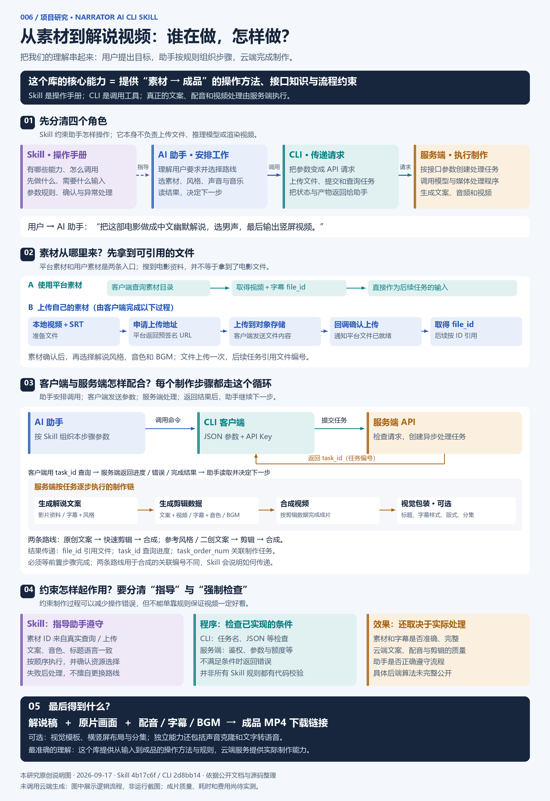

# 006 · Narrator AI CLI Skill

**这个库本身的核心能力：提供把“素材与用户要求”转成“解说视频”的操作方法、接口知识和流程约束，指导 AI 助手调用配套客户端与云端服务。**

用户描述想要的影片、语言、解说风格和呈现方式，由 AI 助手选择资源、填写参数、发起任务并衔接制作环节。这个仓库提供流程说明；配套 Python CLI 负责调用接口，云端平台负责内容生成、剪辑数据生成和视频合成。

我们讨论后的共同理解是：**平台或用户提供素材，Skill 说明如何处理这些素材，助手安排操作，客户端传递请求，服务端执行，最后返回成品。** Skill 规范的是制作过程；规则本身不能保证最终效果。

## 一张图理解完整过程

按图中 **01 → 05** 阅读：先分角色，再看素材进入、任务交互、约束处理，最后看成品。紫色表示 Skill 指导，蓝色表示助手及输入组织，青色表示客户端与文件引用，金色表示服务端处理；虚线表示规则指导，实线表示调用或数据流。

[查看可缩放原图](assets/capability-summary.svg) · [查看完整文字说明](assets/capability-summary-text.md)

本图为本研究根据公开源码与文档整理的原创说明图，日期 2026-09-17；不是产品运行截图或后端真实部署图。固定版本与依据见[来源记录](sources.md)，成片质量、耗时和费用尚未实测。

| 信息 | 内容 |
| --- | --- |
| 上游仓库 | [narrator-ai-cli-skill](https://github.com/NarratorAI-Studio/narrator-ai-cli-skill) |
| 配套实现 | [narrator-ai-cli](https://github.com/NarratorAI-Studio/narrator-ai-cli) |
| 研究日期 | 2026-09-17 |
| 研究状态 | 文档与源码静态分析已完成；未调用生成接口，成片质量、耗时和费用待实测 |
| 详细材料 | [源码与验证笔记](notes.md) · [固定版本与证据来源](sources.md) · [项目元数据](project.json) |

## 1. 核心能力是什么

它解决的是影视解说制作中多个步骤需要反复切换工具的问题：准备素材、写解说稿、选音色和音乐、安排片段、合成视频，再加标题和视觉包装。Skill 把这些操作组织为 AI 助手可以执行的流程。

| 能力 | 用户需要提供或选择什么 | 可以得到什么 |
| --- | --- | --- |
| 素材准备 | 平台已有影片，或自己的视频与 SRT 字幕 | 后续制作任务可引用的素材文件 ID |
| 解说文案生成 | 影片资料或字幕、风格模板、语言、叙述视角 | 解说稿文件；支持第一人称和第三人称等参数 |
| 参考风格创作 | 预设模板，或参考解说字幕 | 用于后续文案生成的风格标识 |
| 配音与剪辑合成 | 解说稿、原片、字幕、音色、BGM | 剪辑数据，以及进一步合成的旁白视频 |
| 成片视觉包装 | 已合成视频、视觉模板、标题和分集参数 | 横屏、竖屏或方屏布局，以及标题、水印和字幕样式等 |
| 独立音频任务 | 音频样本，或音色 ID 与待朗读文字 | 声音克隆结果、文字转语音结果 |
| 任务管理 | 任务参数或任务 ID | 素材检查、积分预算、执行进度、产物链接 |

这些是公开接口与文档支持的能力，不代表每项能力都已在本研究环境中成功运行。[证据 S2、S3、S4、C3](sources.md)

静态检查配套 CLI 的资源表得到：**146 条 BGM、63 条音色、90 条解说风格模板，模板覆盖 12 类题材**。这是目录条目数量，不代表仓库包含相应音频文件、模型权重或永久可用的服务。电影素材目录由云端接口获取；README 宣传约 100 部，本研究没有查询实时可用数量。[证据 S1、C6、C7、C8](sources.md)

## 2. 能实现什么效果

### 场景 A：把一部电影制作成中文解说视频

用户要求示例：

> 用平台里已有的某部电影做一条第三人称中文解说，使用偏幽默的解说风格和男声配音，并配上合适的背景音乐。

按公开流程，预期产物包括：

1. 根据影片内容和风格要求生成的解说稿。
2. 由原片素材片段、解说配音、字幕和 BGM 组合而成的视频。
3. 可查询的任务记录和最终 MP4 下载链接。

进一步选择视觉模板，还可以添加标题、改变画面布局或设置分集。以上是**能力示例，不是本研究已生成的样片**。[证据 S3、S4](sources.md)

### 场景 B：制作保留原声对白的混剪解说

选择原声混剪模式，提供影片信息与对应 SRT 字幕，让写稿过程使用实际对白信息；剪辑阶段再提供视频素材。预期效果是解说与原片对白结合的视频。文档说明字幕用于对齐原声对白，但匹配算法、准确度和对无对白画面的处理效果，需要样片验证。[证据 S3](sources.md)

### 场景 C：为自己的新剧或冷门内容生成解说

上传自己的字幕和视频。新剧模式可以以字幕为写稿依据，不强制要求已知影片资料。它提供了处理平台目录之外内容的入口；字幕不足、版本不一致或视觉信息缺失时的表现尚未验证。[证据 S3](sources.md)

### 场景 D：制作其他语言或不同版式的版本

选择目标语言的音色，同时设置相同语言的解说稿；成片包装时再配置相同语言的标题等文本。多个视觉模板可分别产生不同成片。音色、文案语言和模板文字需要正确联动，不能假设选了外语音色后所有文字都会自动翻译。[证据 S2、S4](sources.md)

### 效果边界

- **处理对象是已有影视素材。** 公开流程围绕原片做文案、配音、剪辑和包装，没有提供从文字生成全新电影画面的实现。
- **搜到片名不等于得到片源。** `search-movie` 返回片名、年份、演员、简介等资料；完整剪辑仍需要可用的视频和字幕。
- **解说风格与视觉模板是两套资源。** 前者影响怎么讲，后者影响成片怎么排版。
- **自动化仍包含选择与确认。** 上游 Skill 要求逐项确认素材和资源；README 的“一句话完成”描述的是自然语言入口，不能保证全程无需交互。
- **实际生成依赖云端。** 安装后仍需要有效 API Key、素材和积分；没有证据表明这两个仓库可独立离线完成全流程。

上述边界由参数、资源流程、Skill 规则和客户端实现支持。[证据 S1、S2、S3、C2、C3](sources.md)

## 3. 如何实现：从一句要求到成品视频

### 3.1 各部分的职责

完整关系见上方总览图的 01 与 03：Skill 指导助手；助手理解需求并安排调用；CLI 发送请求与返回状态；服务端执行制作任务。这里描述的是逻辑职责，不推定未公开的后端算法和部署拓扑。

### 3.2 两条制作路线

| 路线 | 步骤 | 主要用途 |
| --- | --- | --- |
| 原创文案路线（Fast Path） | 素材与风格 → `fast-writing` → `fast-clip-data` → `video-composing` | 根据影片资料或字幕生成文案，再剪辑合成 |
| 二创文案路线（Standard Path） | 可选 `popular-learning` → `generate-writing` → `clip-data` → `video-composing` | 使用预设或参考风格生成文案，再剪辑合成 |

两条路线都可以追加 `magic-video` 视觉包装。使用预设风格时，二创路线可跳过 `popular-learning`。上游称原创路线更快、更便宜，二创路线质量更高；本研究尚无对照结果验证这些性能和质量判断。[证据 S2、S3](sources.md)

原创路线内部还有三个输入模式：

| 模式 | 写稿阶段的主要输入 | 理解要点 |
| --- | --- | --- |
| 热门影视／纯解说 | 已确认的影片资料 | 写稿请求不需要剧集字幕字段；后续剪辑仍需素材 |
| 原声混剪 | 影片资料与 SRT 字幕 | 写稿时结合真实对白信息 |
| 冷门／新剧 | SRT 字幕，影片资料可选 | 从用户提供的内容进入流程 |

### 3.3 各步骤怎样传递结果

任务不是一次调用就同步返回成片。客户端先提交任务，云端返回标识，AI 助手查询状态；完成后，再把产物和关联标识传给下一步。

| 标识 | 用途 |
| --- | --- |
| `file_id` | 引用上传素材或生成文件 |
| `task_id` | 查询任务进度；部分下游接口也要求使用它 |
| `task_order_num` | 关联上下游制作任务；经常作为请求中的 `order_num` 值 |
| `learning_model_id` | 选择解说风格；名称本身不证明它对应训练后的模型权重 |

最终合成时，原创路线使用 `fast-clip-data` 的 `task_order_num`；二创路线使用 `generate-writing` 的 `task_order_num`，同时要求 `clip-data` 已完成。Skill 将这些接口差异写进规则，帮助 AI 正确衔接任务。[证据 S2、S3、S5](sources.md)

## 4. 技术原理是什么

### 4.1 Skill 层：向宿主 AI 提供专业操作知识

`SKILL.md` 描述适用任务、流程顺序和共同规则；`references/` 提供详细参数、资源说明、响应结构和错误处理方法。宿主 AI 读取这些内容，结合用户要求组织命令。

其原理是通过上下文中的操作知识引导模型使用工具。这个仓库没有实现独立的常驻工作流执行器；逐项确认、语言一致、轮询和失败处理等要求，主要由宿主 AI 依照说明执行，不能一概视为 CLI 已强制执行的校验。[证据 S2、C3](sources.md)

### 4.2 CLI 层：将命令映射到云端 API

| 技术 | 作用 |
| --- | --- |
| Python 3.10+、Typer | 运行命令行程序，定义命令和参数 |
| HTTPX | 发送 HTTP 请求与上传文件 |
| HTTPX-SSE | 读取服务端流式事件 |
| PyYAML | 读写本地配置 |
| Rich | 显示表格、任务状态和错误 |

`TASK_TYPES` 将 9 类任务名称映射到接口路径。`task create` 解析 JSON 后调用对应接口；默认服务地址为 `https://openapi.jieshuo.cn`，鉴权信息放在 `app-key` 请求头中。这层负责接口调用，没有提供本地文案模型推理或视频渲染实现。[证据 C1、C2、C3、C5](sources.md)

### 4.3 内容层：按资料或字幕生成文案，再形成剪辑数据

从输入输出可以确认，影片资料、字幕、风格、语言和叙述视角构成写稿条件；文案再与原片、音色和 BGM 一起进入剪辑流程，随后生成成片。

**对接口设计的解释是：字幕既提供对白语义，也提供与原片时间位置关联的依据，因此可以作为文案与素材之间的桥梁。** 但公开客户端没有给出逐句匹配、镜头切分、旁白时长适配或原声取舍的具体算法。不能把常见实现方法当作该项目已经采用的事实。

二创路线还暴露 `refine_srt_gaps` 场景分析选项，说明存在增强处理入口；文档不足以证明默认会完整理解每一帧画面。[证据 S3、C3](sources.md)

### 4.4 基础设施层：异步任务与对象存储

- 创建任务后，通过查询接口获取初始化、执行中、成功、失败或取消状态；CLI 也支持以 SSE 读取流式事件。
- 上传时先申请预签名地址，再把文件 PUT 到对象存储，最后回调确认上传。
- 后续任务引用文件 ID，避免在每一步重复传输视频。
- 成片和任务产物以文件信息或链接形式交付。

这些流程可从客户端确认，不能据此确定后端的具体调度框架、队列实现或渲染引擎。[证据 C2、C3、C4、C10](sources.md)

### 4.5 哪些算法或服务尚不能确定

| 问题 | 当前证据与边界 |
| --- | --- |
| 使用哪种大模型？ | 后端依赖文档列出 OpenRouter 接入 Claude／GPT，以及 Anthropic 直连备选；具体任务的模型版本未核验 |
| `pro`、`flash` 是否就是某家模型？ | 只是公开参数选项，不能直接对应特定供应商 |
| 风格学习是否训练模型？ | 只确认输入参考内容、返回风格标识；不足以认定是微调、权重训练或某一种提示词提取算法 |
| 配音是否全部来自 MiniMax？ | 音色目录有 `MiniMaxVoiceId`，也有其他格式；不能据此推定完整供应商路由 |
| 是否用 FFmpeg、MoviePy 或某种视觉模型？ | 这两个仓库未提供足以确认的服务端实现 |
| Redis、Postgres 和渲染队列是否已按文档运行？ | 文档列出这些组件，但含待完成条目；未做部署验证 |

这两个公开仓库能帮助理解和复用调用流程，尚不足以独立重建完整的视频制作平台。[证据 C7、C9](sources.md)

## 5. 研究价值与下一步

最值得复用的是它把专业任务拆成可组合步骤的方法：资源准备、任务创建、结果查询、文件传递和后续加工。Skill 的价值在于解释接口依赖和容易出错的条件；成片质量仍取决于素材与云端处理。

本阶段已完成能力与原理研究，项目保留“研究中”状态，后续可使用同一段视频和字幕开展验证：

1. 跑原创路线，记录文案、任务状态、积分、耗时和成片。
2. 检查文案事实、画面对应、配音字幕同步与原声衔接。
3. 同素材比较二创路线，判断额外步骤是否带来可见收益。
4. 测试外语与视觉模板的语言一致性、裁切和分集效果。

当前没有生成样片、运行截图或线上演示，`demo` 字段保持为空；项目封面使用上述原创研究说明图。准备步骤和验收表见[研究笔记](notes.md)。

## 来源与许可证

研究基准固定为 Skill `4b17c6f2175bd532c92db778a847f8fb6bdd3177` 和 CLI `2d8bb1463058fb36f267f205994dca38b32f037d`，两者均采用 MIT 许可证。上游检出位于被忽略的 `upstream/`；本子项目为中文研究整理，没有复制影视、音频或模型权重。完整来源及版权信息见[来源记录](sources.md)。
