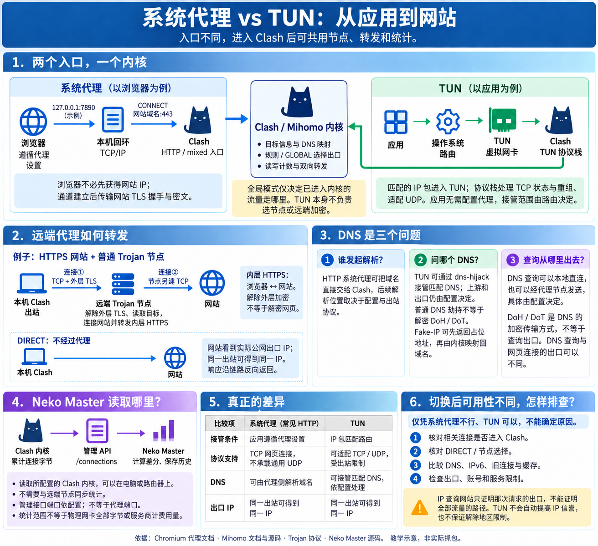
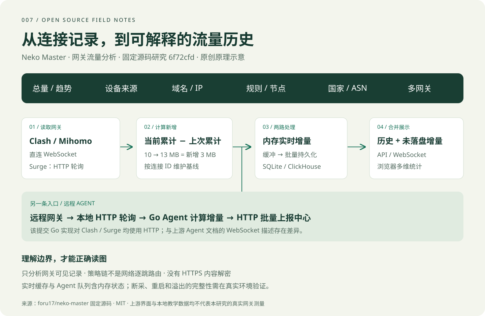
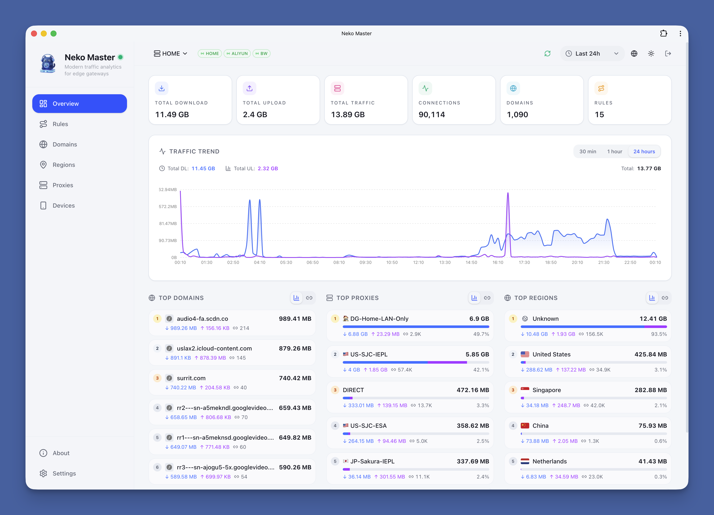

# 007 · Neko Master

从 Clash 等代理客户端内核采集连接与流量信息，保存历史并按设备、域名和节点展示；统计来自内核本地转发计数，无需远端同步。

有网络请求时，客户端内核在转发过程中计数，Neko Master 从管理 API 读取并汇总；不需要与远端代理服务器同步统计。[我们的理解全文](understanding.md)。

| 信息 | 内容 |
| --- | --- |
| 上游 | [foru17/neko-master](https://github.com/foru17/neko-master) |
| 基准 | `6f72cfd0db69e2952713f24a648812407fef1e78`，2026-09-17 阅读 |
| 许可证 | MIT，Copyright (c) 2025 foru17；[原文](third-party/LICENSE.neko-master) |
| 能力展示 | [静态研究页](../../site/apps/007-neko-master/index.html)，交互需通过本地 HTTP 服务打开 |
| 深入阅读 | [能力与场景](capabilities.md) · [原理与源码](architecture.md) · [研究记录](notes.md) |
| 证据 | [来源清单](sources.md) · [固定文件与 SHA-256](source-manifest.json) |
| 状态 | 源码分析与教学展示已完成；真实网关端到端验证待开展，保持“研究中” |

## 先看两张引导图



[继续看底层交互高清图](assets/clash-network-flow.png) · [逐步解释](assets/clash-network-flow-text.md)

## 采集与存储全貌

想先弄懂代理底层交互，阅读 [Clash 系统代理 / TUN 高清图](assets/clash-network-flow.png)、[矢量版](assets/clash-network-flow.svg) 和 [逐步解释与官方来源](assets/clash-network-flow-text.md)。研究页顶部也提供完整图片。



本图为本研究原创架构示意，不是产品截图。[文字说明](assets/capability-summary-text.md)

## 能力概览

| 能力 | 可以回答的问题 | 数据边界 |
| --- | --- | --- |
| 总览与趋势 | 哪个时间段流量变大？ | 来自连接字节增量；文档的低延迟描述未经本研究实测 |
| 域名与 IP | 哪些服务消耗流量，关联哪些地址？ | 依赖网关 host / sniffHost / destinationIP 等字段 |
| 设备统计 | 哪个内网 IP 用量最大？ | 来源 IP 是主要依据，经过 NAT 后可能不能区分终端 |
| 规则与节点 | 命中什么规则，选中什么策略组和节点？ | 读取策略元数据，链图不是网络逐跳探测 |
| 地理分布 | 目标属于哪个国家、网络组织？ | 目的 IP 的 GeoIP / ASN，不等于用户位置 |
| 多网关与 Agent | 能否集中看多个局域网？ | 后端 ID 隔离统计，远程 Agent 主动上报 |

## 上游界面



来源：固定提交下 `assets/neko-master-overview-light.png`，原图未修改。图中数字属于上游展示，**不是本研究产生的流量**。域名、规则、地区三张原图可在研究页切换，详见 [图片来源](assets/README.md)。

## 实现摘要

1. 直连 Clash/Mihomo 使用 WebSocket，直连 Surge 默认约 2 秒间隔 HTTP 轮询。
2. 按连接 ID 保存上次累计字节，以本次减上次计算新增量；初见连接计当前累计，计数回退走重置分支。
3. 新增量同时进入实时内存和批量缓冲，查询合并历史与待落盘数据。
4. 默认 SQLite WAL；直连默认约 30 秒或缓冲达到 5000 个聚合条目时触发写入。可选 ClickHouse，存在多种写入模式。
5. 按后端、时间、域名、IP、设备、规则、链等维度汇总，经 API / WebSocket 送到浏览器。

**源码与文档差异**：该提交 Go Agent 的 `collectClash()` 实际使用 HTTP GET `/connections`，由循环轮询调用；上游 Agent 文档写的是 WebSocket。研究分别描述直连与 Agent，不将两者混用。[分析依据](architecture.md#6-agent-与可靠性边界)

## 本地查看

在研究仓库根目录执行：

```powershell
python projects/007-neko-master/web/build.py
python -m http.server 8765 --bind 127.0.0.1 --directory site
```

打开 `http://127.0.0.1:8765/apps/007-neko-master/`。页面没有外部字体或图表 CDN，不连接网关。交互实验中的 MB 数值是人为构造的教学输入。

```powershell
node --test projects/007-neko-master/experiments/model.test.mjs
python projects/007-neko-master/experiments/verify.py
python scripts/projects.py check
python scripts/build_site.py
```

上述检查验证教学模型、来源与静态产物，不等同于运行上游。产物已按 GitHub Pages 子路径准备，尚未公开部署，`demo` 留空。[维护说明](web/README.md)

## 阶段结论

适合家庭、实验室和多网关环境的流量观察与分流排查。可复用的设计包括网关适配器、连接差分、实时内存与批量落盘分离、统一维度聚合和远程主动上报。

网关 API 无法保证覆盖未经过网关的流量、全部短连接和断采期间已消失的记录。缓存与去重含内存状态，重启、队列溢出和写入失败需实测。项目没有提供 HTTPS 内容解密，也不能直接作为严格计费依据。
