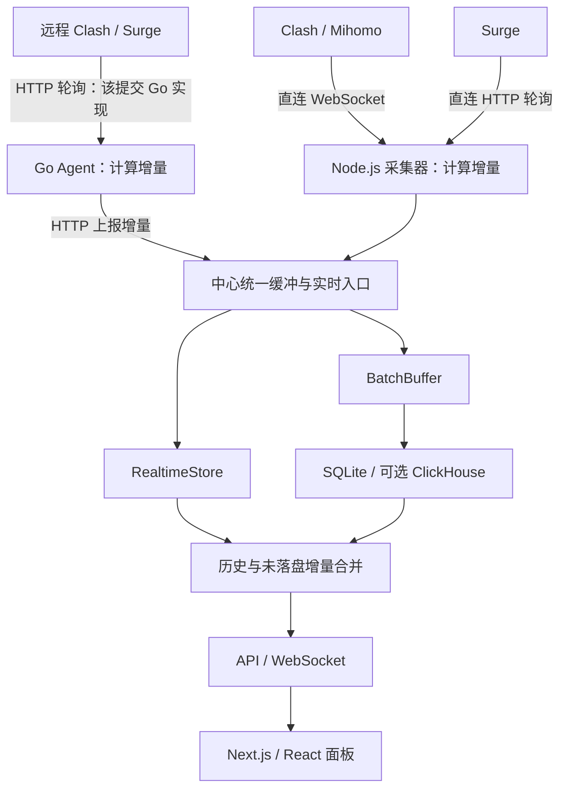

# 实现原理与源码证据

阅读基准：`6f72cfd0db69e2952713f24a648812407fef1e78`。结论来自固定源码，不是所有 release 的保证；来源链接见 [sources.md](sources.md)。

## 1. 模块与数据流

Agent 已在边缘计算差分，中心不会把增量再次当成累计值差分。GeoIP 与策略缓存是采集和展示中的补全服务。

| 目录 | 职责 |
| --- | --- |
| `apps/collector/src/modules/collector/` | 直连、连接状态、增量、缓冲 |
| `modules/realtime/` | 内存维度、时间桶与历史合并 |
| `apps/collector/src/database/` | SQLite 连接、表、仓储 |
| `modules/stats/` | 查询和写入模式选择 |
| `modules/geo/` | 地理位置与 ASN 查询 |
| `modules/app/app.ts` | Agent 接收、鉴权、去重、缓冲协调 |
| `apps/agent/internal/` | 远程采集、基线、队列、上报与心跳 |
| `apps/web/` | 页面、查询缓存、WebSocket 与图表 |

## 2. 采集与增量

`GatewayCollector` 通过 WebSocket 获取 JSON 连接列表，维护心跳和退避重连。`createCollector()` 以连接 ID 为 `activeConnections` 的键，保存上次上传 / 下载、维度、lastSeen 与是否已计连接数。

正常情况分别计算“新增上传 = 本次 upload − 上次 upload”和“新增下载 = 本次 download − 上次 download”。需要区分：

1. 初见连接：当前累计值作为初始新增量，有流量时连接数加一。
2. 已知连接有新流量：只计差值；已计过的连接不重复加连接数。
3. 已知连接空闲：仍更新 lastSeen 和基线，避免清理后重复全量计入。
4. 任一方向回退：源码把**两个方向的当前值**都作为重置后的新增量，并重新允许计连接数；不是逐方向独立 `max(0, delta)`。

连接不再出现在 Clash 列表中时，其状态被移除。非常短的连接、末次快照到关闭之间的尾部流量以及重启丢失基线需要实测，关闭注释不构成零漏计证据。

Surge 默认轮询间隔 2000 ms，网络耗时和失败退避会影响实际间隔。近期接口可能重复返回完成请求，实现还跟踪 `CompletedRequestInfo`，处理重复返回和最终计数。

证据：`gateway.collector.ts` 的 `createCollector()` 和 `surge.collector.ts`。

## 3. 实时内存与批量写入

新增量同时交给 `realtimeStore.recordTraffic()` 和 `BatchBuffer.add()`。缓冲键包括后端、分钟、域名、目标 IP、首个代理、完整链、规则、规则内容及来源 IP。同键累加字节与显式连接数。缓冲聚合不是全链路去重，不能替代连接基线或 requestId。

直连默认每 30000 ms 刷新，缓冲达到 5000 条时提前刷新。5000 指聚合条目，不是原始数据包。Agent 中心缓冲使用独立变量，默认同样约 30 秒。

查询把库中历史与内存待提交数据合并。成功持久化后清理相应实时维度。ClickHouse 明细与汇总可能分别成功 / 失败，源码按结果分别处理，失败时可能保留实时状态或回写 SQLite。

好处是减少写入同时保持近期可见性；代价是提交状态与缓存清理必须协调。当前未进行跨数据库原子性、崩溃窗口和并发重复计算的运行验证。

## 4. SQLite 与 ClickHouse

SQLite 通过 better-sqlite3 启用 WAL，`synchronous = NORMAL`。表结构覆盖域名、IP、规则、设备、代理、国家、分钟 / 小时及交叉维度，配置、认证、缓存和 Agent 状态也存于 SQLite。

`stats-write-mode.ts` 显示：默认保留 SQLite 写入；`CH_ONLY_MODE=1` 且 writer 满足条件时跳过 SQLite 流量 / 国家统计；减少 SQLite 维度写入还取决于 writer 健康状态、查询来源与开关。跳过 SQLite 后如果 ClickHouse 写失败，直连存在回写 SQLite 的分支。

不能把 ClickHouse 描述为“始终双写”或“完全替代 SQLite”；元数据仍保留在 SQLite，历史读取还受查询来源和迁移影响。端到端故障恢复待验证。

## 5. GeoIP 与策略路径

GeoIP 大致执行：私网识别 → 内存缓存 → SQLite 缓存 → 同 IP 请求合并 → 队列查询 → 保存结果。失败地址有冷却，队列有上限。

本地模式从 MaxMind MMDB 补充国家、城市和 ASN，但 `queryGeo()` 在本地不可用或查询失败时可能调用在线 API。因此 Local 不是严格离线承诺；目的 IP 国家也不等于访问者或代理出口位置。

Clash 直接读取策略链。Surge 从 notes 匹配 `[Rule] Policy decision path: …`，按 ` -> ` 分割并反转，使终点代理排在数组前；失败回退到 `policyName` / `originalPolicyName`，全空使用 DIRECT。另有后台策略组选择缓存。链图依赖网关元数据，不执行路由追踪。

## 6. Agent 与可靠性边界

`Runner.Run()` 启动采集、上报、心跳、配置同步和策略同步循环。该提交 Go `Client.Collect()` 中 Clash 和 Surge 都使用 HTTP GET，分别取 `/connections` 和 `/v1/requests/recent`。

这与 `docs/agent/overview.md` 将 Clash 描述为 WebSocket 不一致。**直连 Clash 的 WebSocket 不能作为 Go Agent 的实现证据**。本次未核对其他发布二进制是否与此提交一致。

Agent 先计算增量，进入内存 queue，再发往 `/api/agent/report`。失败批次保留原 requestId 重试；中心用内存 Map 去重，常量与注释约定约 5 分钟窗口。接收成功表示进入中心缓冲，不代表已经落盘。

据源码可以推断以下边界，尚未做故障注入：

- Agent 重启可能失去队列和连接基线。
- 超过 `MaxPendingUpdates` 时会丢弃较旧数据并累计 dropped。
- 中心重启会丢失内存 requestId 集合；晚到重试不能保证永远被识别。
- 接收成功到定时落盘之间存在需要测量的崩溃窗口。

Token 绑定也有条件：服务端验证后端 Token 和 agentId，但 `isAgentBindingAllowed()` 对前一 Agent 心跳超过 10000 ms 的情况允许重新绑定。文档中“同 Token 不能绑定不同 agentId”不是无条件永久限制。

这些是代码状态及其推论，不是已复现漏洞或完整安全审计。

## 7. 前端与静态部署边界

前端 Next.js / React，TanStack Query 管理请求和缓存，Recharts / React Flow 等展示统计和路径；Collector 用 Fastify REST 与 ws 推送。README 描述 WebSocket 不可用时可回退 HTTP，但本次未验证各页面及所有部署组合。

完整应用需要常驻采集服务与数据库。本研究页使用原生 HTML / CSS / JavaScript，仅解释能力与数据变化，没有嵌入运行中的 Neko Master，可作为 GitHub Pages 静态内容。
