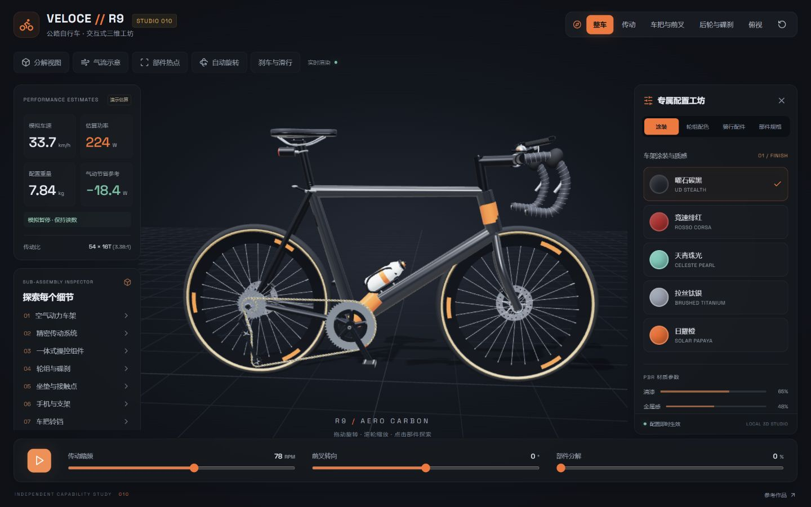
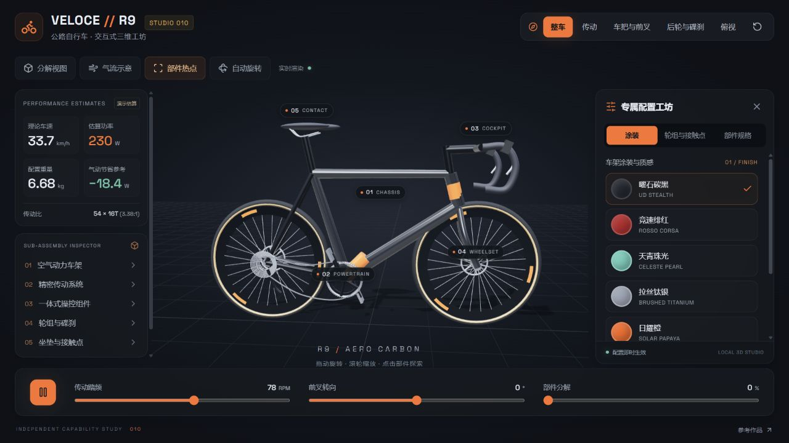

# 010 · Veloce Bike Studio

**定位：自行车：机械结构与联动的 3D 实现参考。** 本项目用于学习和复用 React 界面、Three.js 渲染、程序化建模与产品运动规则的组织方式。

[实现说明网页](https://yydshly.github.io/0917_codex_project/apps/010-veloce-bike-studio/guide.html) · [交互演示](https://yydshly.github.io/0917_codex_project/apps/010-veloce-bike-studio/) · [两项目的共同理解](../../docs/3d-implementation-reference.md)




基于参考网页的交互能力，独立实现可运行的自行车三维展示与配置器。界面、模型和交互源码均保存在本子项目内；没有复制原站打包代码，也不将其声称为开源库。



## 已实现能力

| 功能 | 本地实现 |
| --- | --- |
| 3D 浏览 | 拖动旋转、滚轮缩放、自动旋转；整车、传动、车把前叉、后轮碟刹、俯视五组相机 |
| 涂装 | 碳黑、红、青绿、钛银、橙五种 PBR 材质；颜色、清漆、金属感联动 |
| 轮组 | 36 / 50 / 64 mm 三种框高，联动轮框几何、胎边、重量与气动参考值 |
| 接触点 | 黑 / 棕 / 白三种坐垫与把带配色 |
| 部件检视 | 五个三维热点、模型点击拾取、分类列表，点击聚焦并展示中文规格 |
| 传动动画 | 曲柄、牙盘、链节、轮组联动；0–140 RPM 踏频、播放 / 暂停 |
| 前叉转向 | −30° 至 +30°，车把、前叉、前轮联动 |
| 分解展示 | 0–100% 连续分解进度，轮组、传动、车把、坐垫分离；自动调整整车取景 |
| 气流示意 | 可切换的运动流线；明确为演示，没有 CFD 求解 |
| 响应式 | 桌面三栏工坊，手机完整车型、纵向配置；面板收起和全局重置 |

## 运行

需要 Node.js 22+、npm、Python 3，以及支持 WebGL 2 的浏览器。

```powershell
cd projects/010-veloce-bike-studio/web
npm ci
npm run dev -- --host 127.0.0.1 --port 4180
```

访问 `http://127.0.0.1:4180/`。当前任务已启动本地预览；以后关闭进程后可按上述命令重启。页面不需要后台服务，不会连接原站或上传数据。

```powershell
# 从仓库根目录构建当前子项目的静态演示
python projects/010-veloce-bike-studio/web/build.py
# 全站构建与索引核对
python scripts/build_site.py
python scripts/projects.py check
# 核心估算逻辑测试
cd projects/010-veloce-bike-studio/web
node --test tests/config.test.mjs
```

静态产物：`site/apps/010-veloce-bike-studio/`。已配置相对资源路径，适用于 GitHub Pages 子路径；由 GitHub Actions 构建并发布，公开结果以部署记录为准。

## 项目结构

- [web/src/App.jsx](web/src/App.jsx)：配置 UI、控件与统一状态。
- [web/src/scene.js](web/src/scene.js)：程序化三维模型、材质、动画、相机与拾取。
- [web/src/config.js](web/src/config.js)：配置数据与演示估算公式。
- [architecture.md](architecture.md)：结构、数据流、计算假设及边界。
- [sources.md](sources.md)：参考来源、许可证与依赖版本。
- [design-qa.md](design-qa.md)：桌面 / 手机视觉与交互验收。
- [notes.md](notes.md)：本次研究与验证记录。

## 复刻范围

参考对象是 Arena 上的单页作品，未发现公开源码仓库和原站许可证，所以元数据使用 `source`，`repo` 留空，上游 commit 不适用。为了支持这类研究，项目工具新增了 `--source` 参数，原有 `--repo` 用法保持兼容。

这是**能力复刻与独立三维实现**：保留深色工业风、橙色交互、参数 / 场景 / 配置三栏结构；界面改为中文、模型重新建模、手机布局可完整使用。未承诺像素级一致、CAD 公差、真实材料参数、商业商品真实性或风洞实验精度。

所有演示参数及气动数值均不能用于真实产品选型或制造。模型采用程序化几何，没有原站精细纹理与真实 CAD 数据；不含下单、账号、遥测接入、导出和配置持久化。

## 截图来源

- `assets/desktop.png`、`mobile.png`、`exploded.png` 和英文命名的视角截图：2026-09-17 参考网页实拍，原作者权益保留，仅作研究证据。
- `assets/local-*.png`：本项目在本机浏览器中的实际渲染与交互截图。
- `assets/comparison-*.jpg`：以相同视口对参考图与本地截图进行并排排版的 QA 图，不是运行效果拼接伪造。

## 第二轮：传动与部件细节

已补足链片、滚子、销轴、12 片带齿飞轮、双导轮后拨、牙盘紧固件、气嘴和打孔碟片。新增传动特写、独显、慢动作与单齿步进；点击顶栏“传动”即可进入。

详细的原有缺口、模块分工与当轮边界见 [细节模块分析](detail-modules.md)。第六轮已补上后飞轮档位选择；仍无受力与齿面接触求解。

## 第三轮排查

[细节排查与优化报告](regression-review.md)记录分解检视、转向连接、轮组制动、手机检视及键盘交互的修复和实拍证据。当前回归测试 12 项通过。

## 骑行配件补全

已补车把把带、开孔坐垫、手机支架、可试听铃铛与水壶架。右侧「骑行配件」可装卸并进入特写；详见[补全说明与实拍](riding-accessories.md)。当前 14 项回归测试通过。

## 刹车与滑行

已加入独立前后刹、握杆与刹车片联动、惯性滑行、减速停车与松刹起步。详见[操作说明、模型边界与实拍](braking-and-coasting.md)。该轮 20 项回归测试通过。

## 变速、车灯与座椅升降

已加入 12 档后飞轮切换、122 节固定销距链条、前后车灯、座管快拆卡扣与 0–80 mm 升降。详见[操作、边界与实拍](gears-lights-seatpost.md)。当前共 23 项测试通过。
