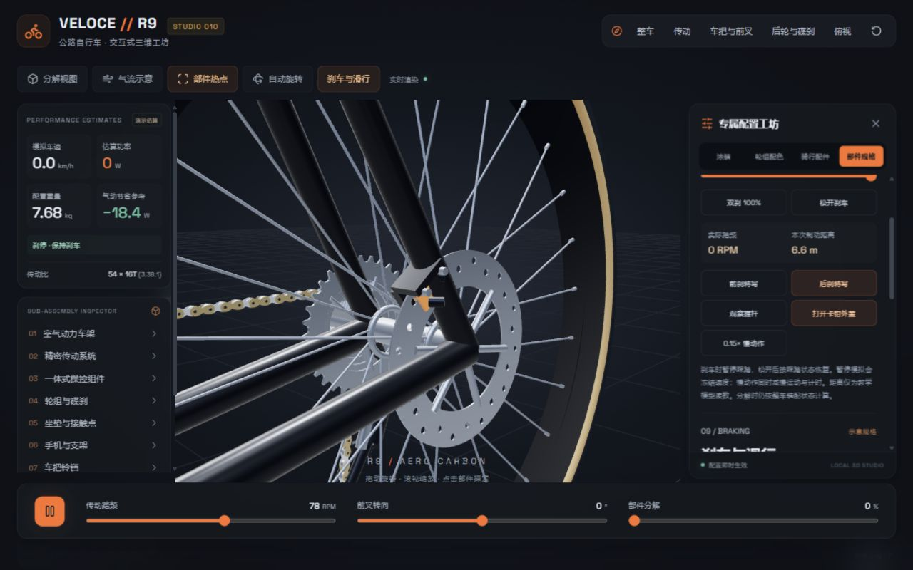
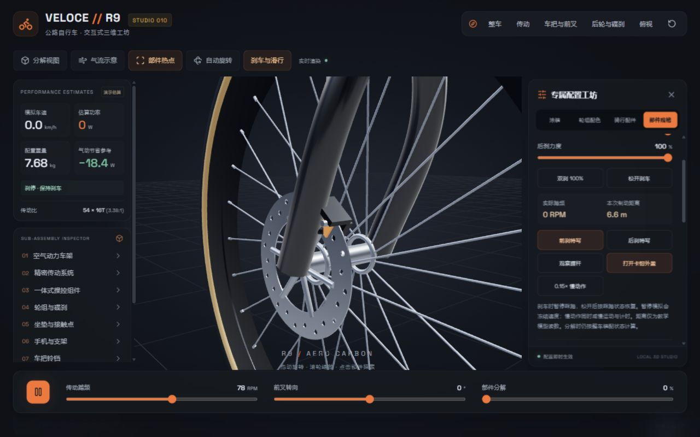
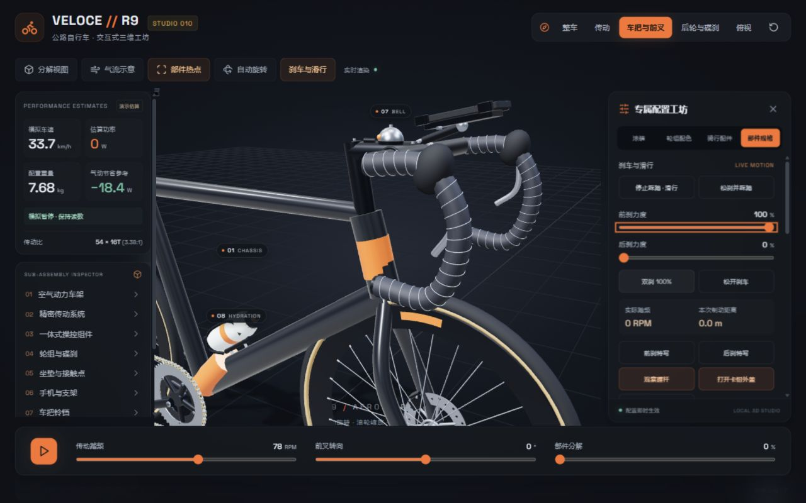
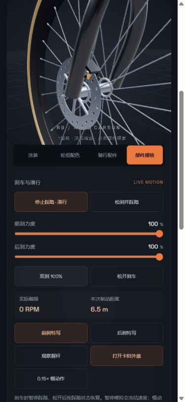

# 刹车与惯性滑行

2026-09-17：将原来的轮组旋转展示补为可控制的教学演示。入口为顶部 **刹车与滑行**，或轮组 / 操控组件规格中的同名入口。

## 已实现

- 前后刹各自 0–100% 力度；对应握杆收拢，卡钳两侧刹车片靠近碟片；松开后复位。
- 车轮持续减速至零，保持刹车时不会反转。模型中任意刹车输入都会暂时切断踩踏驱动，松开后按踩踏开关恢复。
- 「停止踩踏 · 滑行」停止曲柄、链条和飞轮，车轮继续靠惯性旋转，并受简化阻力逐渐减速。
- 「松刹并踩踏」解除双刹、恢复踩踏并逐渐加速。降低设定踏频时，也允许车轮转得比飞轮快，模拟自由轮超越。
- 前刹、后刹与握杆检视，卡钳外侧壳体可打开观察；增加模拟车速、实际踏频、运行状态与本次制动距离。
- 「暂停模拟」冻结时间和车速，保留读数；与刹停明确区分。慢动作按 0.15 倍同时推进动力学和机构动画。
- 单齿步进属于检视：暂停模拟、松开刹车，仅推进机构一齿，不改变速度状态和模拟行程。

## 使用

1. 点击「刹车与滑行」，选择「停止踩踏 · 滑行」：观察实际踏频为 0，而车速仍大于 0。
2. 拖动前刹或后刹力度；也可点击「双刹 100%」观察减速到停稳。
3. 点击「打开卡钳外盖」，通过前 / 后刹特写检查刹车片，或「观察握杆」查看单侧握杆动作。
4. 点击「松刹并踩踏」重新起步。全局重置恢复默认 78 RPM 巡航初态、松刹、合上外盖。

## 模型边界

这是平路上一维教学模型，**不是现实刹车距离预测工具**。不包含轮胎抱死、侧滑、前后载荷转移、翻车、坡度、液压和温升。

实现采用示意阻力减速度 `0.025 + 0.003 × v²`，前 / 后刹最大减速度贡献分别为 4 / 2.5 m/s²，驱动加速度限制为 1.8 m/s²；这些是本演示选取的参数，不来自车辆实测。速度积分内部最大步长为 1/120 秒。分解图仍按完整装配计算减速，不模拟拆散后的物理接触。

本次制动距离在新的制动操作开始时清零，刹停或松开后保留最后数值。配件重量显示与骑行动力学独立，当前没有将重量变化传入惯性计算。

## 验证

- 20 项回归测试通过：原有装配、配置和链路测试，加上巡航稳定、滑行解耦、独立前后刹、组合刹车、停稳不反转、松刹起步、暂停冻结、慢动作一致、帧率稳定和刹车片间隙验证。
- 桌面实测：滑行时实际踏频 0 RPM、车速仍 24.7 km/h；默认巡航双刹后速度 0.0 km/h、显示「刹停 · 保持刹车」。本次运行记录约 6.6 m，仅为该模型读数。
- 松刹起步观察到速度由 0 上升；暂停后切换视角、调整刹车，车速保持 33.7 km/h；单齿步进后车速仍保持。
- 手机 390 × 844 完成滑行、双刹、重新踩踏与视角操作，无横向溢出；静态页面控制台 error / warn 为空。
- 构建通过，仍有 Three.js 单包体积提醒。未进行真实设备触屏或长期性能验证。

截图来自本轮本地静态页面浏览器实拍。代码职责：`riding.js` 负责速度与滑行，`brakes.js` 负责卡钳和刹车片，`scene.js` 分别驱动车轮与传动，`App.jsx` 提供控制和读数。
