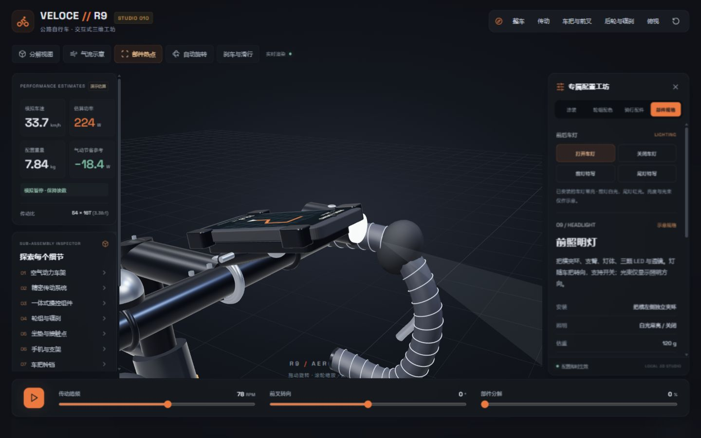
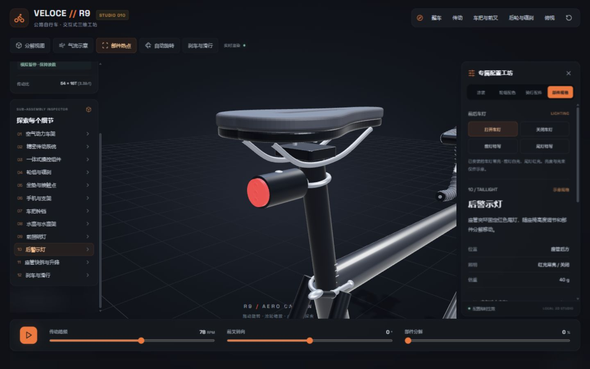
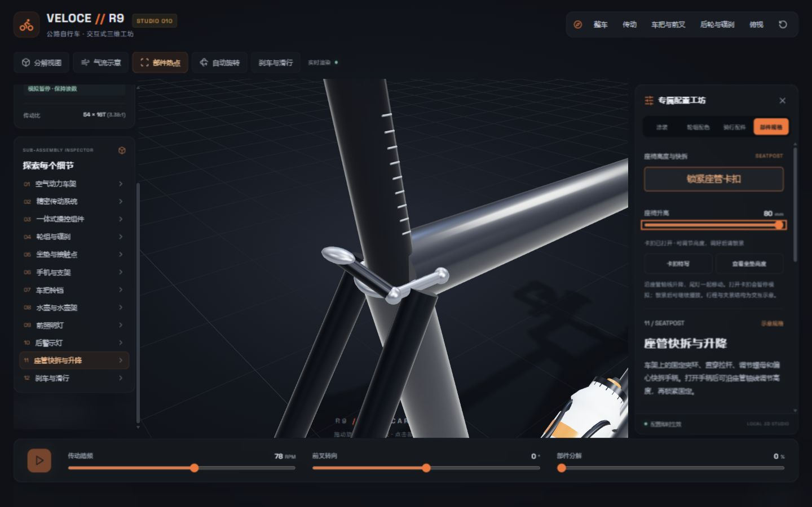
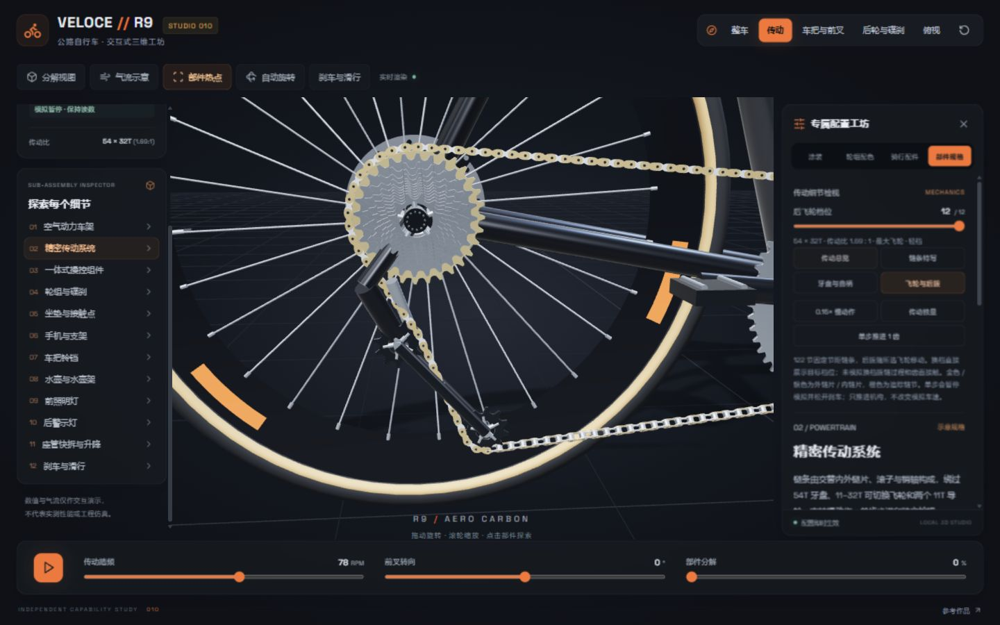
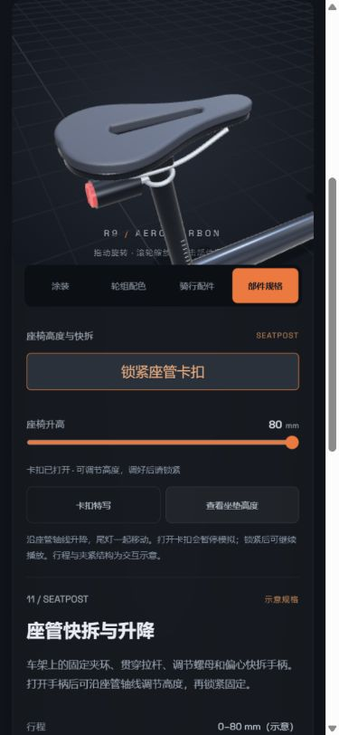

# 变速、车灯与座管快拆

2026-09-18 完成。用户确认继续完善变速与链条，并要求增加灯和座椅升降卡扣。本轮沿用现有工业风与配置面板。

## 操作入口

- 顶栏「传动」：后飞轮档位可选择 11 / 12 / 13 / 14 / 15 / 16 / 17 / 19 / 21 / 24 / 28 / 32T。传动比、链条横向位置、工作齿片高亮、后拨和速度模型一起更新。
- 「骑行配件」：前灯与尾灯默认安装、默认关闭，支持拆装及常亮开关。前灯在车把上，随转向和前部组件分解移动；尾灯在座管后方，随座椅升降。
- 「座椅升降与卡扣」或「坐垫与接触点」：打开卡扣，调节 0–80 mm，再锁紧。打开卡扣会暂停模拟；锁紧后可继续播放。卡扣固定在车架上，座椅沿座管轴线向上、向后移动。

## 实现与边界

链条使用 122 节、12.7 mm 的三维销距。求解器按相邻销轴的直线距离布点，通过固定长度后拨导板的摆角闭合链环；链片不再沿长度方向缩放。包含飞轮与前盘不同平面之间的横向偏移。

本轮直接显示所选档位，不模拟齿片间的拨链过渡。齿形是示意轮廓，没有求解齿面接触、磨损、受力或啮合冲击。54T 前盘参与传动，40T 内盘仍为展示。车速在换档瞬间连续，之后按新传动比和现有教学动力学变化；刹车和惯性滑行保持可用。

车灯包括夹环、支臂、外壳、透镜、LED 和按钮。前灯具有方向光束示意，尾灯为红色常亮；不包含电池、续航和照度标定。默认整车估重因两盏灯增加 160 g，变为 7.84 kg。

座管增加刻度、固定夹环、贯穿拉杆、两端紧固件和可转动快拆手柄。尺寸和夹紧行程是交互示意，不是实际装配规范。

## 验证

- 23 项自动测试通过，包括所有 12 档、多种链条相位的闭合与销距检查，销距误差小于 0.001 mm；导板中心距保持 130 mm。
- 换档保留瞬时车速，曲柄与飞轮按新比例运动，换档后前后刹仍能停车。
- 浏览器实际检查 11T / 32T、开关灯、座椅锁定与升高、恢复默认配置；32T 双刹降到 0.0 km/h，浏览器错误记录为空。
- 手机视口 390 × 844 完成升高 80 mm，文档宽度 375 px，没有横向溢出。
- 静态构建通过，更新到 `site/apps/010-veloce-bike-studio/`，未发布到公网。

## 本地实拍

以下均为本次浏览器中实际渲染与操作截图；没有使用生成图代替运行结果。

