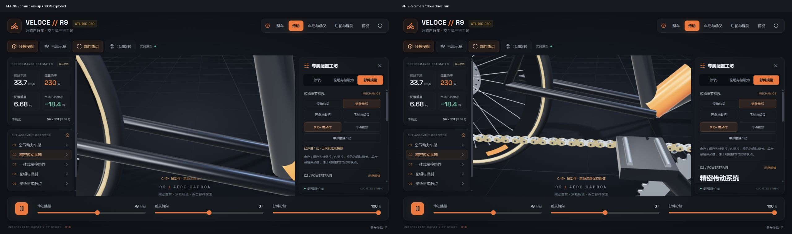
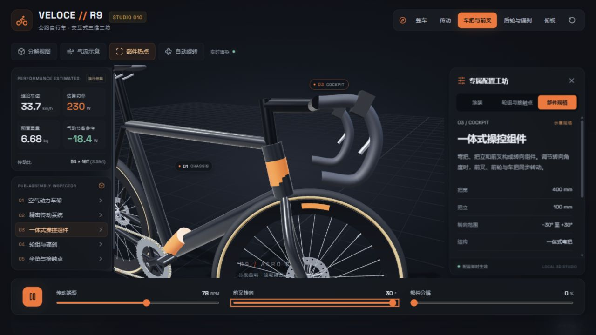
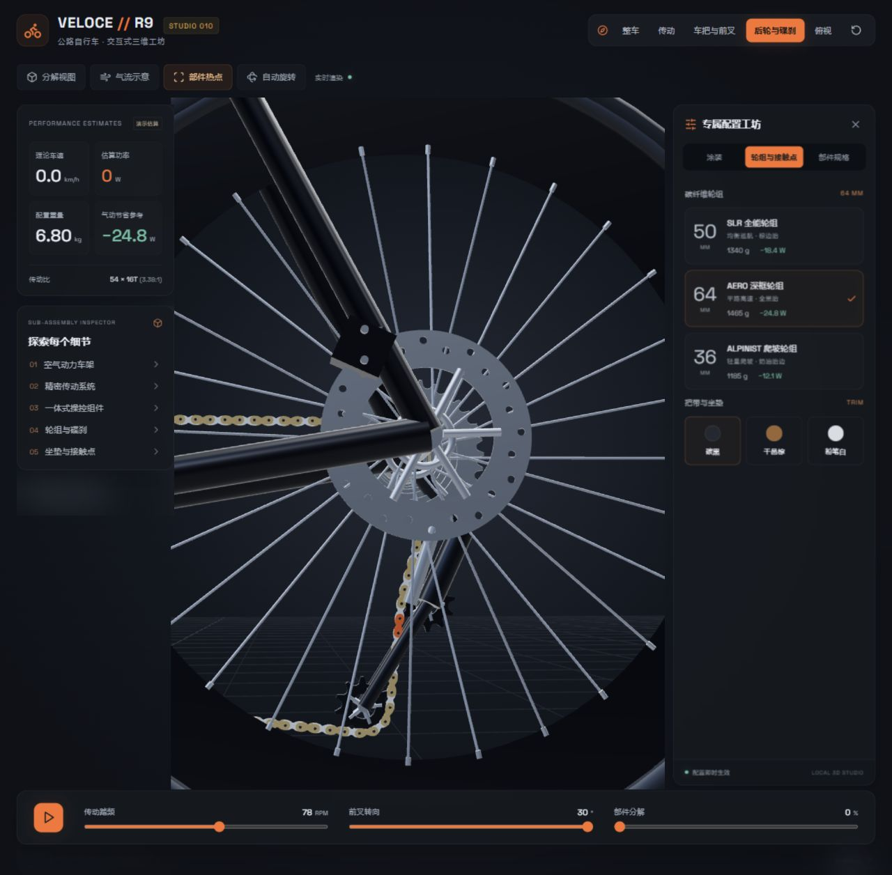
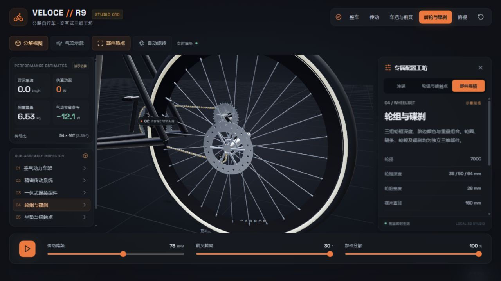
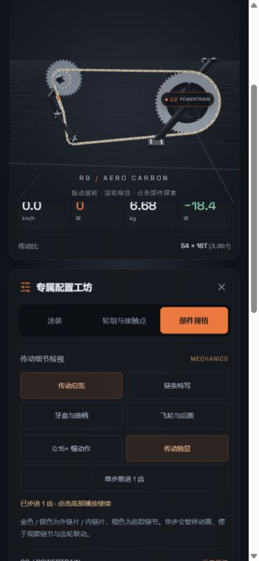

# 第三轮细节排查与优化

日期：2026-09-17。范围：现有本地工坊的组合操作、部件连接与手机检视。保持现有视觉设计，不增加真实换档或受力求解。以下截图均来自本轮本地静态页面，未使用参考网站截图作为修复证据。

## 1. 传动检视 → 分解 → 切回配置（已修复）

**复现**：进入「链条特写」，开启分解到 100%。原先传动装配沿 Z 轴移动 0.32 m，相机目标仍留在原处，画面只剩车架。顶部传动按钮和慢动作反馈本身有效，但组合操作无法继续观察链条。

**修复**：相机位置和目标点一起跟随被检视装配，保持观察距离；同样处理坐垫、后轮、前轮与转向组件。视口高度变化也会重新计算取景。切回涂装或轮组配置时，传动近景回到整车并退出独显。

对照原图均为 1280 × 720；只做并排排版。两图均为链条特写、100% 分解、慢动作播放，不同动画相位及历史步进提示不用于像素匹配判断。

## 2. 转向 → 部件规格 → 恢复默认（已修复）

**发现**：原来前叉绕竖直 Y 轴旋转，而车架头管有倾角；头管下端因此偏离转向组件。关闭配置面板后重置也没有重新打开面板，且机械动画相位没有恢复。顶栏切到车把或后轮时，右栏仍可能显示涂装或之前的部件。

**修复**：前叉和前轮共用沿头管方向的旋转轴；用 −30° 到 +30° 的数学测试验证头管两端保持固定。顶栏部件视角打开对应规格；重置恢复面板和传动相位，切换部件时清除面板旧滚动位置。

原始问题状态留存在 [review-02-before.png](assets/review-02-before.png)。截图用于检查连接外观，轴线不动的精确断言来自测试，而非截图估算。

## 3. 轮组切换 → 制动侧 → 分解（已修复）

**发现**：轮框深度更新时，气嘴、辐条和辐条帽仍使用固定半径，深框状态下气嘴可能埋在轮框中。卡钳虽然不随车轮旋转，但属于车轮装配，分解时会跟轮一起移走。后轮卡钳位置缺少与后上叉对应的支承关系。

**修复**：气嘴及辐条端点随 36 / 50 / 64 mm 轮框内径更新；卡钳分别归属前叉和车架，补安装支座，后卡钳调整到靠后上叉一侧；补飞轮侧轮毂轴段。

浏览器实测深框重量 6.80 kg，爬坡轮组 6.53 kg。近景截图视口分别为 1280 × 1256 与 1280 × 720，不作为同尺寸并排对比。几何仍为示意，不以此声称真实产品公差或安装强度。

## 4. 手机检视 → 单步 → 总览 / 键盘导航（已优化）

**问题**：配置和运动控件位于模型下方，向下滚动后难以同时观察模型和操作。标签页原先没有方向键切换。

**修复**：手机模型区域随页面滚动保持在顶部，并为滚动定位预留模型高度，避免按钮自动定位到模型背后；检视按钮最小高度 40 px。标签页支持左右方向键、Home、End，只有当前标签参与 Tab 顺序。原有可见焦点样式保留。

实测 390 × 844，`scrollWidth = 375 <= innerWidth = 390`，无横向溢出；普通点击链条特写、独显、单齿步进、返回总览全部成功。方向键从涂装进入轮组标签成功。

## 代码级发现与修复

- **隐藏部件误点选**：射线结果增加完整父级可见性过滤。不是仅检查网格自身的 `visible`；测试涵盖隐藏父级和可见兄弟装配。
- **暂停时重复更新链条**：运动增量全零时跳过实例矩阵重算和上传；测试验证暂停不增加矩阵版本、运动后改变矩阵、重置后精确恢复初值。
- 新增 `web/src/assembly.js`，集中倾斜转向轴、检视偏移及可见性判断，避免相机和组件运动使用不同公式。

## 验证与边界

- 12 项配置、链路和装配回归测试全部通过。
- 静态子路径构建通过；本轮浏览器控制台 error / warn 为空。
- 桌面组合操作、手机滚动检视、方向键标签切换通过。
- 尚未完成真实设备触屏、屏幕阅读器、完整对比度与长期性能测试；不宣称完整无障碍合规。
- 仍为固定齿比运动学模型：没有真实换档、链条刚体齿面接触、弹性张紧、自由轮滑行和制动受力求解。车架截面、把带纹理、座管与坐垫轮廓仍可继续精化。
- JS 约 783 kB，gzip 约 215 kB，构建仍有单包体积提示。

结论：本轮复现和代码检查确认的问题已修复，并完成对应复验；未将剩余工程仿真能力视为已实现。
