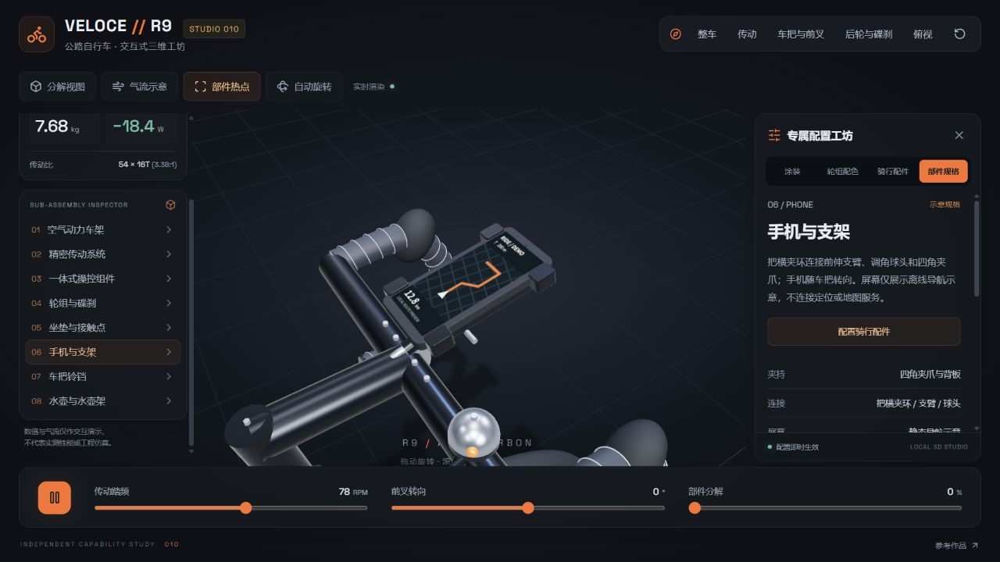
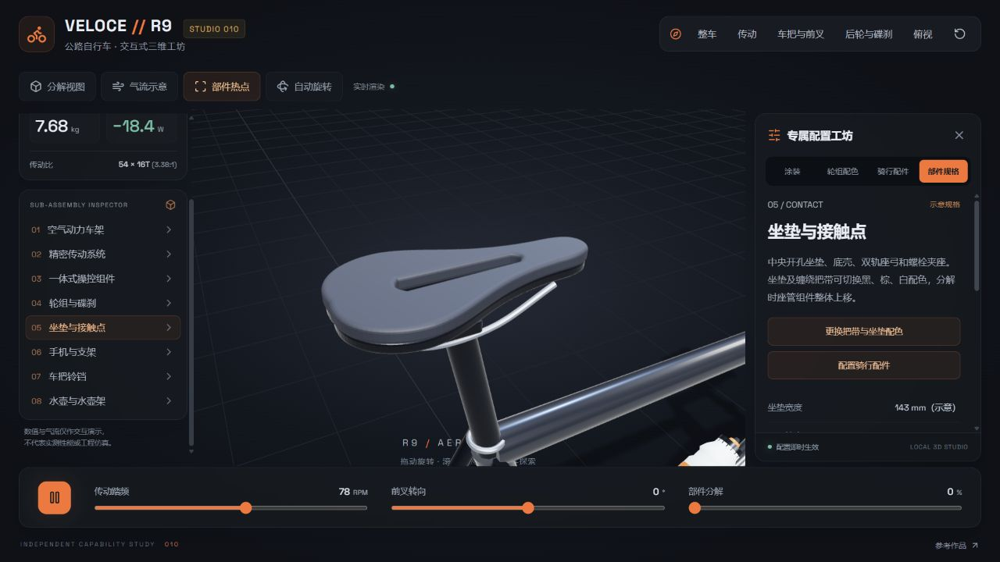
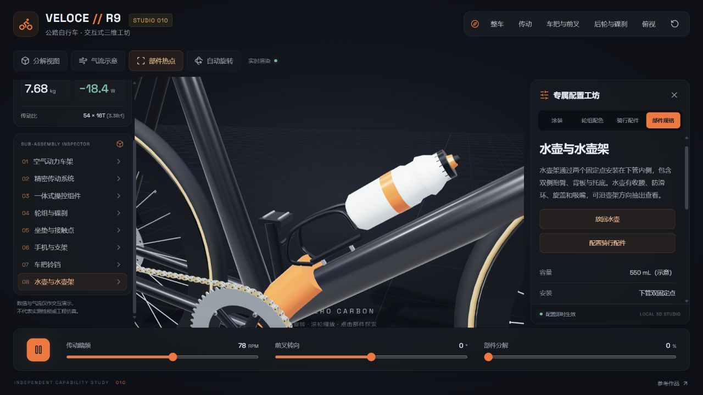

# 车把、坐垫与骑行配件补全

日期：2026-09-17。按用户要求补全把手、座椅、前部手机支架、铃铛和装水位置。均为本地独立三维几何。

| 部分 | 本轮补全 | 操作 |
| --- | --- | --- |
| 车把 | 螺旋缠绕把带、端塞、圆润手变胶套、刹车握杆、把立夹环与螺栓 | 车把视角；黑 / 棕 / 白配色；随前叉转向 |
| 坐垫 | 中央贯通开孔、包覆层与底壳、双轨座弓、双螺栓夹座、座管夹环 | 独立特写；随坐垫装配分解 |
| 手机支架 | 把横夹环、支臂、球头、背板、四角夹爪、手机与屏幕 | 装卸；手机特写；随车把转向和分解 |
| 铃铛 | 金属铃罩、底座、夹环、拇指拨杆与敲击头 | 装卸、特写、拨动与试听 |
| 水壶与壶架 | 550 mL 示意水壶、收腰、色环、瓶盖、吸嘴；双臂壶架、背部支架、固定螺栓和托底 | 装卸；取出查看与放回 |

## 使用与实现边界

右侧新增 **骑行配件** 标签页，三组配件默认安装。关闭开关可拆下，点「查看」会安装并聚焦该配件。部件列表扩展到八项，点击模型上的配件也能打开规格。

手机和铃铛属于车把，转向、分解时保持连接。水壶架属于车架，抽出时仅水壶移动；传动独显会隐藏附属配件。恢复默认会装回配件、放回水壶并清除响铃次数。

默认估重由不含配件的 6.68 kg 更新到 7.68 kg：手机与支架 300 g、铃铛 50 g、满水水壶与壶架 650 g。拆装更新重量；抽出查看不代表从携带装备中移除。

手机屏幕为本地绘制的**静态导航示意**，不接入定位、地图或手机数据。铃声由 Web Audio 合成，仅在点击试听时播放；不可用时仍显示拨杆动作与说明。尺寸与重量为场景示意，不是制造 CAD 或厂商实测规格。

## 实拍

- [铃铛近景与试听反馈](assets/fittings-bell.png)
- [30° 转向与 100% 分解](assets/fittings-steered.png)
- [整车](assets/fittings-full.png)
- [手机配置页](assets/fittings-mobile.png)

截图均为本轮本地静态页面实拍，没有用生成图替代运行结果。

## 验证

- 14 项回归测试通过，新增配件重量、装配归属、转向跟随、取壶与放回、装卸可见性测试。
- 浏览器实测：拆手机后 7.38 kg；仅拆铃铛和水壶后 6.98 kg；装回后 7.68 kg。
- 试听显示拨杆 / 合成声反馈；未做扬声器声学测量。
- 桌面近景、转向分解组合、手机装卸和布局均已查看。390 × 844 下无横向溢出，`scrollWidth = 375 <= innerWidth = 390`。
- 静态构建通过；浏览器 error / warn 为空。仍有 Three.js 单包体积提示。

几何模块：`web/src/fittings.js`；规格与重量：`config.js`；检视偏移：`assembly.js`；配置与试听：`App.jsx`。
