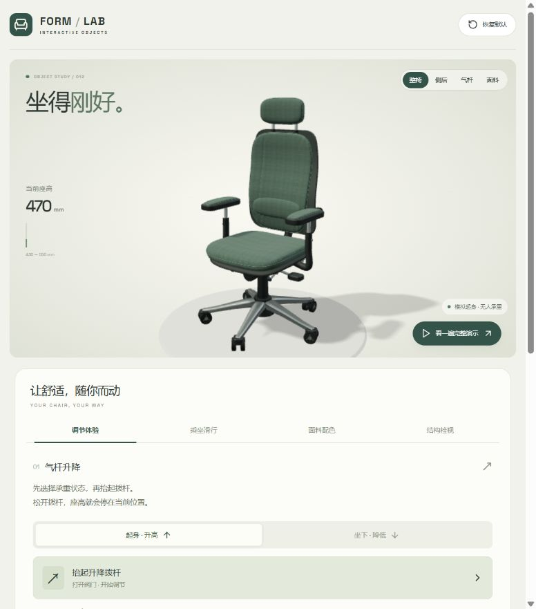
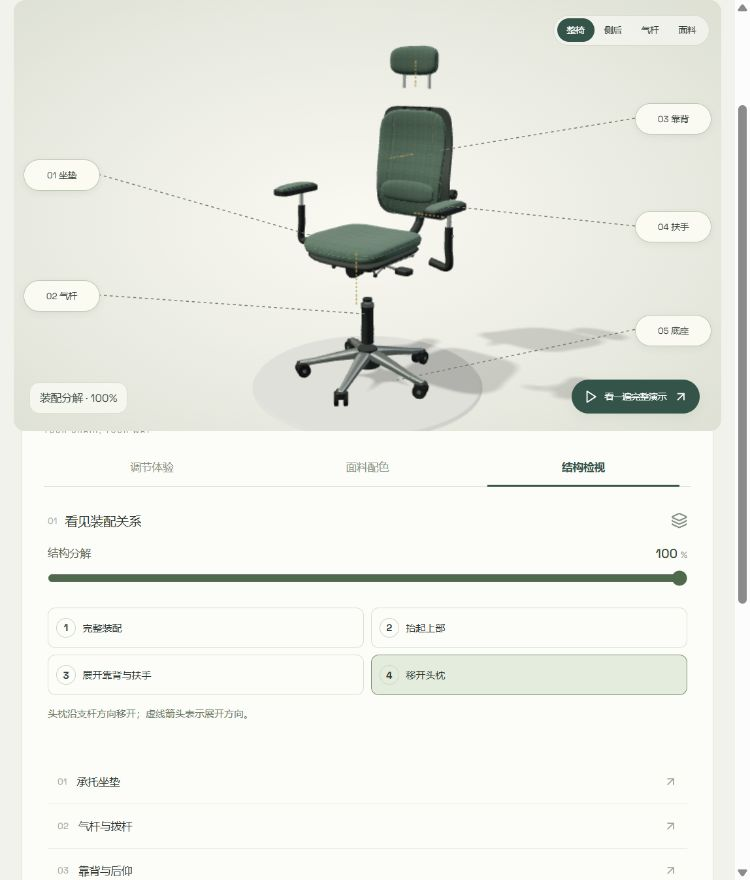
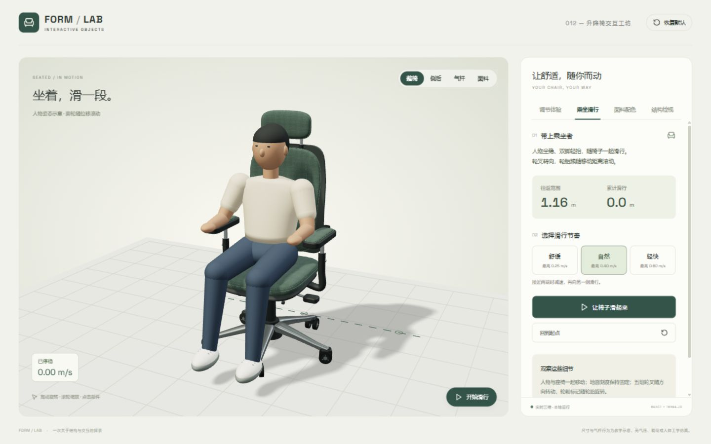
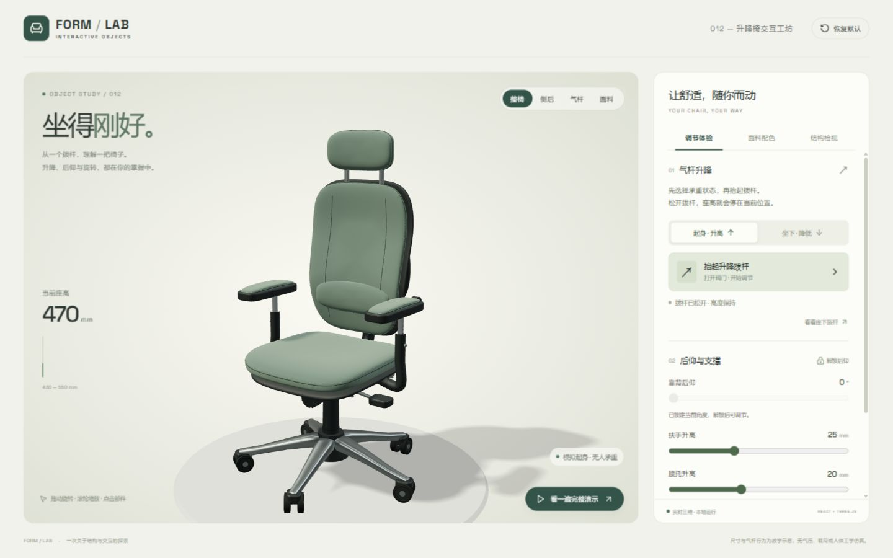
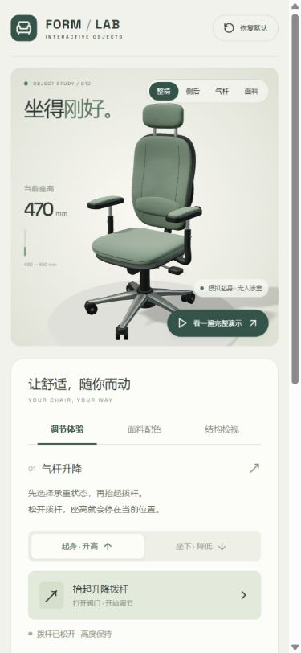
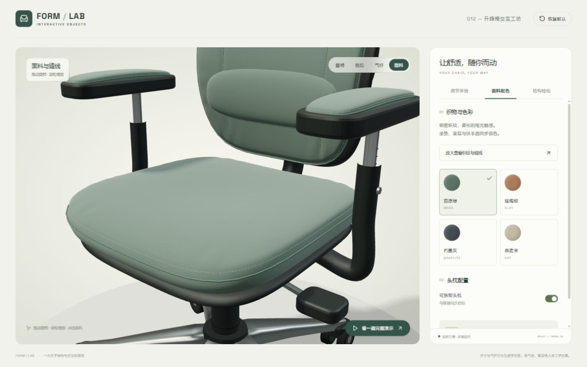
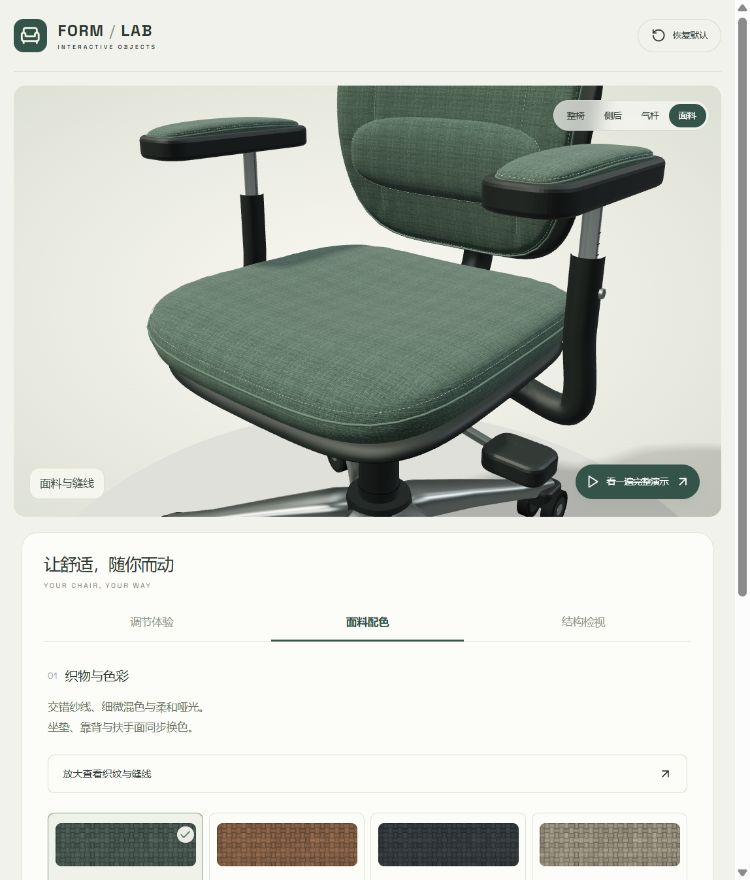
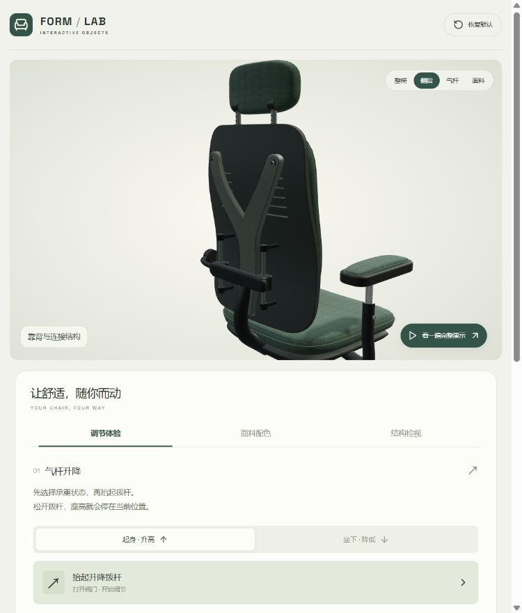

# 012 · 升降椅交互工坊

**定位：升降椅：产品配置与乘坐交互的 3D 实现参考。** 本项目用于学习和复用 React 界面、Three.js 渲染、程序化建模与产品运动规则的组织方式。

[实现说明网页](https://yydshly.github.io/0917_codex_project/apps/012-lift-chair-studio/guide.html) · [交互演示](https://yydshly.github.io/0917_codex_project/apps/012-lift-chair-studio/) · [两项目的共同理解](../../docs/3d-implementation-reference.md)

把 010 自行车演示的三维交互方法迁移到升降椅，用一个可以实际操作的场景解释 React 界面、Three.js 模型和自定义运动规则如何配合。

本地预览：[打开升降椅演示](http://127.0.0.1:4181/apps/012-lift-chair-studio/)。静态输出为 `site/apps/012-lift-chair-studio/`，已通过 GitHub Pages 公开发布。

## 可以体验什么

| 能力 | 操作与结果 |
| --- | --- |
| 气杆升降 | 选择「起身」或「坐下」，点击「抬起升降拨杆」；空载上升、承重下降，范围 430–550 mm |
| 保持高度 | 点击「松开升降拨杆」，立即停止升降并保持当前位置 |
| 后仰锁定 | 解锁后调节 0–22°，再锁定角度；坐垫与靠背按 1 : 3 的示意比例联动 |
| 扶手与腰托 | 扶手调节 0–70 mm，腰托调节 0–50 mm |
| 椅身旋转 | 上部装配可旋转 0–360°，五星底座保持固定 |
| 乘坐滑行 | 简化人物坐在椅子上往返滑行，三档速度、暂停与复位；五组轮叉转向、轮胎随位移滚动 |
| 面料配置 | 苔原绿、暖陶棕、石墨灰、燕麦米四种颜色；可拆装头枕 |
| 结构检视 | 五组部件编号、引线、选中高亮与特写同步；四阶段分解显示展开方向 |
| 自动演示 | 用户点击后循环展示升高、降低、后仰和旋转，可随时停止 |

升降按钮是点击保持的演示操作，不要求一直按住鼠标。自动演示时相关手动控件暂时禁用，面板跟随实际展示状态更新。

## 如何实现

- **React 19.2**：配置面板、承重状态、拨杆开关、滑杆、材质选项和读数。
- **Three.js 0.180**：程序化生成椅子、材质、灯光、相机、阴影、拾取和动画。
- **自定义 JavaScript 模型**：根据阀门和承重状态计算高度，处理行程限制、锁定和自动演示。
- **Vite 6.4**：构建静态网页，字体和脚本本地打包。

主要文件：

| 文件 | 职责 |
| --- | --- |
| [App.jsx](web/src/App.jsx) | 用户操作、面板、配置状态 |
| [model.js](web/src/model.js) | 升降与锁定规则、自动演示、参数 |
| [scene.js](web/src/scene.js) | 建模、部件层级、渲染、相机和拾取 |
| [surfaces.js](web/src/surfaces.js) | 软包曲面、变截面脚架和程序化织物贴图 |
| [fabric-data.js](web/src/fabric-data.js) | 三维模型与配色色样共用的纱线纹理数据 |
| [back-shell.js](web/src/back-shell.js) | 带开孔的曲面后壳、Y 形支撑与曲面细分 |
| [inspection.js](web/src/inspection.js) | 统一视角选择和分阶段展开规则 |
| [inspection-overlay.js](web/src/inspection-overlay.js) | 可点击编号、部件引线与展开方向箭头 |
| [ride.js](web/src/ride.js) | 往返路径、速度、暂停、距离累计及乘坐状态切换 |
| [rider.js](web/src/rider.js) | 穿着衣物的简化人物、坐姿和滑行地面 |
| [styles.css](web/src/styles.css) | 桌面布局与手机端固定模型视窗 |
| [model.test.mjs](web/tests/model.test.mjs) | 升降、端点、释放、后仰锁定和演示测试 |

没有加载椅子 GLB 模型。软包使用自定义封闭曲面，包含坐垫承托起伏、前沿下弯、靠背弧度、包边与缝线；五星脚采用变截面几何。织物使用程序化颜色、凹凸和粗糙度贴图，并加入柔和的布面反射。气杆套筒属于底部装配，伸缩杆连接座下托盘；靠背、扶手及头枕沿父子层级跟随座椅移动。

质感升级还包含脚轮轮毂、支撑连接件、拨杆支点和扶手刻度；重新调整主光、环境反射与柔化阴影。点击顶部「面料」或配色面板中的「放大查看织纹与缝线」可检查局部。980 px 以下采用上下布局，避免模型在双栏中被挤小。

第二轮细化修正了侧面织纹拉伸，改为随部件移动的三向投影；针脚按实际曲线长度等距排列。软包加入静态边缘收褶与缝合浅压痕，高光和缝线跟随配色变化。腰托补上背部导轨、连接杆和旋钮防滑纹。特写收起大标题与座高读数，并按椅身转角决定观察方向。

第三轮统一重做全部四种配色的布面：512 px 纱线贴图包含经纬交错、纱线粗细和局部深浅变化；重新校准凹凸强度，提高粗糙度并减弱塑料感高光。坐垫、靠背、腰托、头枕和双侧扶手共用这套面料；配色按钮使用同源纹理的放大色样。织纹比例是演示设计值，并非厂商实测规格。

第四轮重做椅背背面：曲面硬壳与前侧软包分层，开孔为真实几何；Y 形支撑通过端部紧固件连接后壳。腰托增加滑架握位、导轨固定座及行程标记，头枕接口补充套座与支杆刻度。点击「侧后」查看。

交互与机构补全：视角、选中部件和说明使用统一状态，重新点击当前视角可恢复标准机位。座下新增转轴、双段连杆、锁止销和锁定手柄；点击「查看后仰锁止机构」，可观察解锁、后仰、锁定的变化。「结构检视」分为完整装配、抬起上部、展开靠背与扶手、移开头枕四阶段，支持点击图中编号进入特写。分解时暂停机构调节，并提供收回装配入口。

本轮共 12 项测试通过，构建通过；浏览器实测视角与说明同步、四阶段分解、编号点击、调节禁用与恢复，以及 22° 后仰锁定。检查了常规窗口和 390 px 手机布局，未记录控制台错误。锁止与连杆为可观察的教学机构，尚未加入真实阻尼调节或载荷计算。

交互实拍：[解锁状态](assets/interaction-06-unlocked.png)、[锁定状态](assets/interaction-06-locked.png)、[手机分解视图](assets/interaction-06-mobile.png)。

## 验证与限制

### 乘坐滑行

点击「乘坐滑行」，再点击「让椅子滑起来」或画面中的「开始滑行」。人物保持坐稳、轻抬双脚的姿态，随整椅在 1.16 m 范围内往返移动；固定地面网格提供位移参照。舒缓、自然、轻快三档最高速度分别为 0.25、0.40、0.60 m/s，接近两端时减速并反向。暂停会保留位置与累计距离，「回到起点」停止滑行并清零距离。

五组轮叉逐渐转向移动方向；轮胎角位移按实际帧间距离、轮叉方向及 33 mm 轮半径计算，轮毂加入标记帮助观察旋转。进入此模式收回分解、停止自动演示、关闭升降拨杆、回正后仰与旋转；切换其他页签或部件特写会退出滑行，人物与场地随之隐藏。默认不自动播放。

这是程序化人物与预设运动路径，未使用人体扫描或动作捕捉；没有模拟蹬地、接触力、摩擦力、平衡或人体关节反解。起停是交互暂停，不代表真实制动过程。

本轮共 **15 项测试通过**，静态构建通过。新增测试覆盖范围、速度、往返换向、距离累计、暂停保持、恢复、退出清零及与其他演示状态的互斥。浏览器实际检查启动、暂停、回到起点、速度选择及 390 px 手机布局。

[滑行后暂停](assets/ride-07-paused.png) · [手机端乘坐滑行](assets/ride-07-mobile.png)

2026-09-18：8 项自动测试通过（5 项运动规则、3 项几何有效性与缝线贴合）；静态构建通过。初版浏览器实测升至 550 mm、降至 430 mm、松杆保持、22° 后仰锁定、材质切换、头枕拆装与结构分解。第一轮质感升级再次检查升至 550 mm、松杆保持、22° 后仰锁定，以及 390、765、1440 px 下的显示效果。第二轮检查换色、椅身旋转后的侧后观察、织物渲染和手机近景。几何测试不代表视觉质量验收，实际截图另列如下。

这是运动学交互演示：升降速度固定为 34 mm/s，未计算气体压力、人体载荷、阻尼、碰撞、结构强度或人体工学。乘坐滑行采用预设路径和轮胎角位移，不进行整椅刚体物理求解。高度读数表示直立状态的名义座高，后仰时坐垫各位置高度并不相同。

开发与构建：在 `web/` 下安装锁定依赖并启动 Vite；从仓库根目录运行 `python projects/012-lift-chair-studio/web/build.py` 生成静态演示。项目已接入仓库构建脚本。

## 实际运行截图

以下截图均来自本地浏览器，不是设计稿或生成图。

四种配色实拍：[暖陶棕](assets/fabric-03-clay.png)、[石墨灰](assets/fabric-03-graphite.png)、[燕麦米](assets/fabric-03-oat.png)。本轮再次通过 8 项测试和静态构建；浏览器检查四种配色，未记录着色器错误。

背部升级后共 9 项测试通过，新增射线检查后壳开孔贯通且中间壳体保留厚度。实际检查腰托 0–50 mm 和最大 22° 后仰；机构仍为运动示意，开孔不代表通过透气或结构强度测试。

来源、独立实现说明和依赖许可证见 [sources.md](sources.md)；迁移分析见 [notes.md](notes.md)；质感问题及处理记录见 [visual-quality-review.md](visual-quality-review.md)。

## 发布验证

2026-09-18 已上线。[发布工作流](https://github.com/yydshly/0917_codex_project/actions/runs/35287605549)成功；两项目与首页共 60 个公开文件核对一致。实际检查模型渲染及核心交互，浏览器未记录错误。详见 [发布记录](experiments/deployment.json)。
