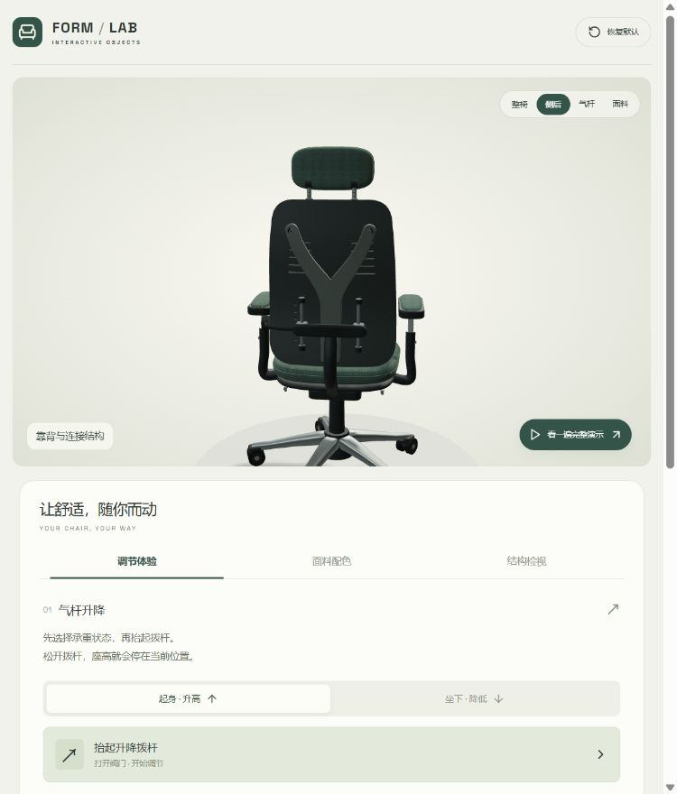
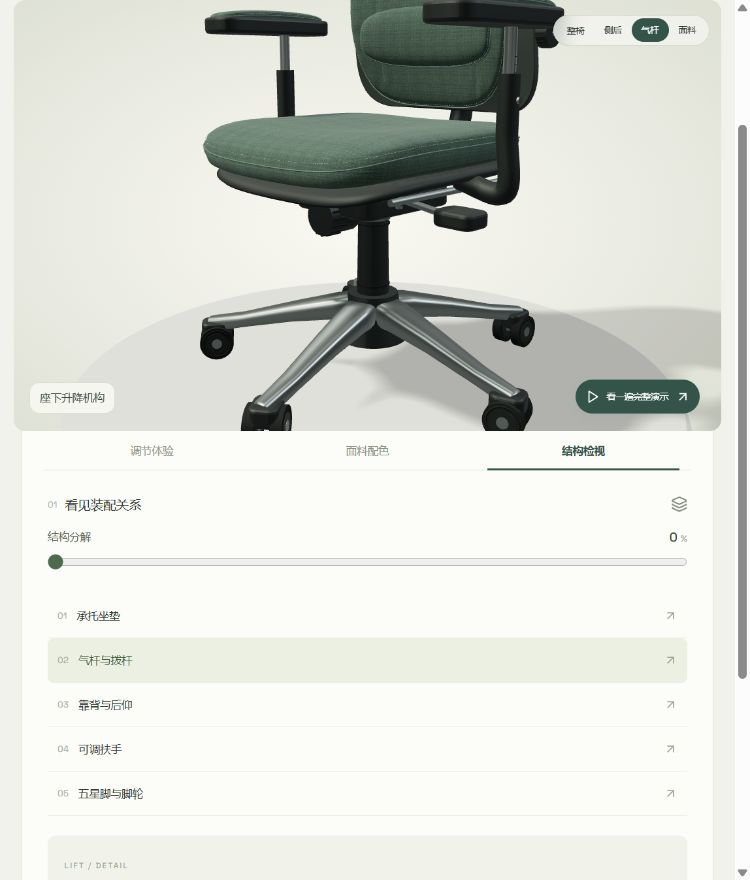
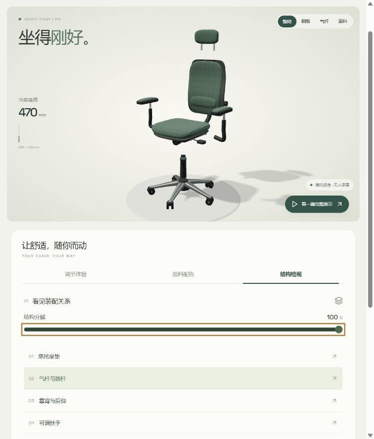

# 升降椅后续模块优化分析

日期：2026-09-18。以下审查记录对应优化前的本地 012 演示，使用 Product Design audit 的截图流程，并核对本地源码；后续实现情况见文末。

## 检查步骤

1. **椅背及调节入口：整体可用。** Y 形支撑、后壳和腰托滑架已可辨识；视角按钮与说明状态存在同步问题。
2. **气杆与座下机构特写：可用，表达仍偏简化。** 升降拨杆、托盘、气杆能看到，但锁定与阻尼的内部关系不能通过当前模型理解。
3. **100% 结构分解：可用，教学解释不足。** 装配组能分离，但缺少图中标注、装配方向和逐步拆解；不能据此理解完整装配顺序。

截图均于本次检查实时采集，来自 `http://127.0.0.1:4181/apps/012-lift-chair-studio/`。

## 优化优先级

| 优先级 | 模块 | 当前依据 | 建议与完成标准 |
| --- | --- | --- | --- |
| 高 | 视角、选中部件、说明同步 | 本轮从顶部「侧后」打开「结构检视」，画面仍是靠背，列表与说明却选中气杆。App.jsx 分别维护 view 和 part；顶部按钮只改 view | 使用统一选择入口，部件高亮、特写、名称和说明一致；重新点击当前视角能回到标准机位 |
| 高 | 座下后仰及锁定机构 | 步骤 2；源码中后仰直接旋转 pan/backPivot，锁定仅改变状态，座下旋钮没有调节状态 | 补充可见转轴、连杆、锁止件与阻尼调节反馈；解锁、后仰、锁定三种状态在模型上可区分 |
| 高 | 结构分解教学 | 步骤 3；explode 主要移动上部装配、靠背、扶手、头枕和柱组 | 为选中部件增加高亮、编号和引线；分步展开并显示装配方向；分解时可明确切回装配状态再操作机构 |
| 中高 | 渲染与状态更新效率 | scene.js 静止时仍 requestAnimationFrame/render，每约 80 ms 回传新的 motion 对象；小套座也使用高细分 cushionGeometry | 静止按需渲染、数值改变才回传；小零件降低面数，共享重复几何；先测量帧率和耗电再决定优化幅度 |
| 中 | 头枕与扶手调节 | 步骤 1、2及源码：头枕只有拆装状态，扶手只有升高参数；头枕可见铰链和刻度但不可独立调节 | 头枕增加高度/角度，扶手增加前后滑动/内外旋转；设定明确限位并检查极限姿态穿插 |
| 中 | 软包受压与回弹 | 承重状态只驱动气杆升降，曲面收褶为静态 | 可加入轻微坐垫下沉、腰托压缩与回弹，增强“坐下/起身”的可见区别；明确属于视觉示意 |
| 中 | 脚轮、轮叉与接地 | 步骤 2、3；脚轮只有静态几何，未模拟滚动或转向 | 若增加整椅移动，脚轮转向、轮胎滚动与位移应对应；单纯产品展示时可先改善轮轴与接触阴影 |
| 中 | 小屏操作及状态反馈 | 本轮 765 px 画面中的视角按钮与说明文字偏小；源码保留较小字号，三维动画未读取减少动态效果偏好 | 放大点击区域与关键读数；键盘选择部件、状态变化播报、减少动态效果选项；另做 390 px、缩放和屏幕阅读器测试 |

## 可选扩展

- 产品展示：保存配色与调节参数、恢复上次配置、导出当前画面。
- 结构教学：零件清单、分步讲解、装配路径、气杆局部剖视。
- 对比展示：同机位比较不同配色与配置，减少反复切换和记忆。

## 边界

视角与说明不同步属于本轮实际观察到的问题；静止渲染和配置缺项由源码确认。其余如受压变形、脚轮移动和保存配置，是能力扩展，并非现有按钮损坏。

未做帧率、显存、耗电、WCAG 对比度数值、完整键盘或屏幕阅读器测试，不据截图宣称卡顿或无障碍达标。未重新跑全部升降/后仰测试；之前测试通过不能覆盖本次发现的视角与说明同步问题。

建议下一轮顺序：**交互同步 → 座下机构 → 分解讲解**。若近期主要在手机上演示，则把性能测量及小屏操作提前。

## 后续实现：交互与机构补全

- 已修复视角、部件选中和说明不同步；统一选择入口，增加部件高亮与重复点击回正机位。
- 已加入座下转轴、双段连杆、锁止销和锁定手柄，解锁/锁定同步改变几何姿态及提示。真实阻尼调节仍未实现，不能把此项视为完整物理机构。
- 已加入五组图中编号、引线、四阶段展开与方向箭头；分解时禁用机构操作，并可一键收回继续调节。
- 界面读数改为仅在数值或状态变化时回传。按需渲染、性能测量与几何精简仍待后续处理。
- 本轮 12 项自动测试和构建通过。浏览器验证侧后说明同步、编号进入特写、四阶段分解、调节禁用与恢复、22° 后仰锁定，并检查 390 px 布局；没有宣称完整无障碍或物理仿真达标。

证据：`assets/interaction-06-exploded.png`、`interaction-06-unlocked.png`、`interaction-06-locked.png`、`interaction-06-mobile.png`。

## 后续实现：人物乘坐滑行

新增独立「乘坐滑行」页签、简化人物和固定地面网格。整椅及人物沿预设路径往返，支持三档速度、暂停、恢复与回到起点；轮叉转向，双轮根据实际帧间位移转动。滑行与分解、升降及原有自动演示互斥。15 项测试通过。

剩余扩展可以优先考虑：蹬地与收脚动作、头枕高度及倾角、扶手前后滑动、坐垫轻微受压、静止按需渲染。真实摩擦、碰撞和平衡需要额外物理系统，当前预设轨迹不能等同于这些能力。
